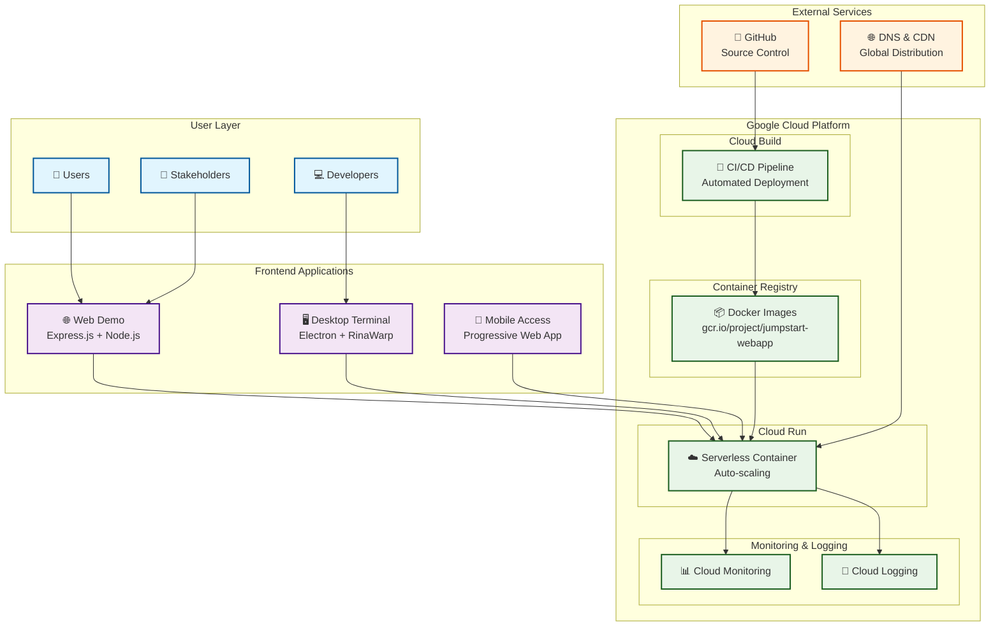
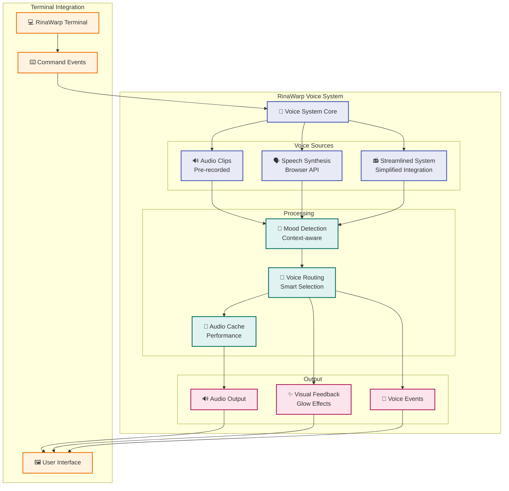
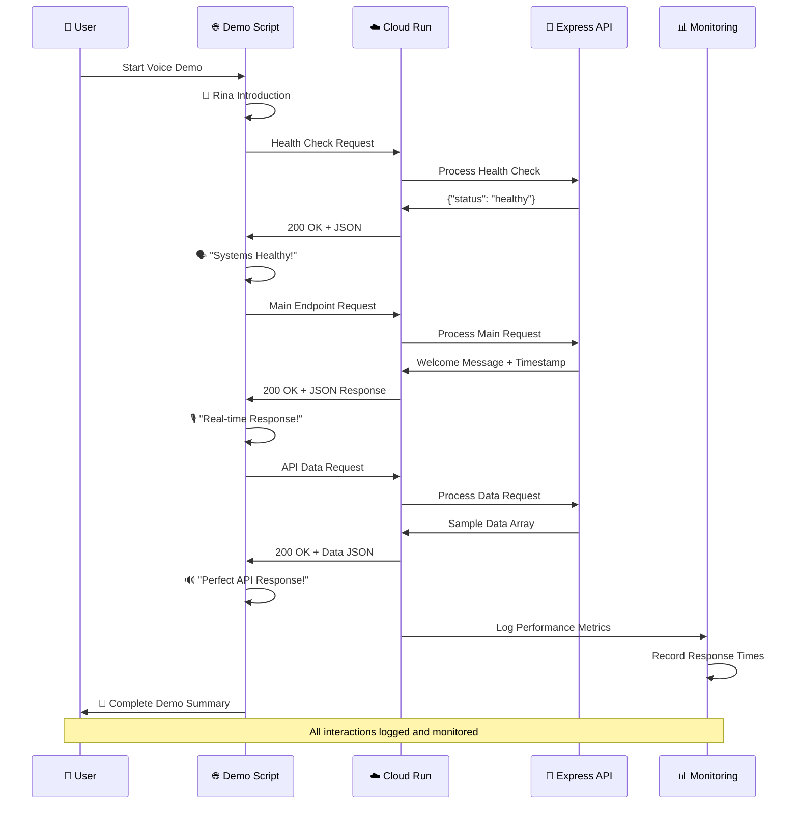
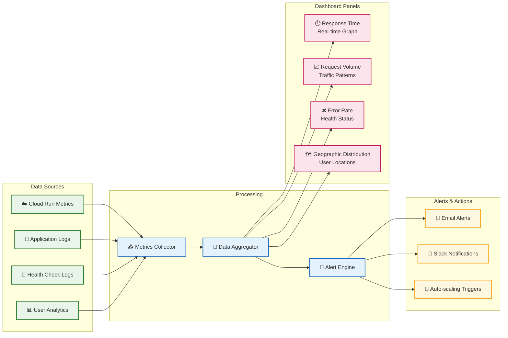

# 🏗️ RinaWarp Terminal - Architecture Diagrams

This document contains Mermaid diagrams showing the system architecture of RinaWarp Terminal.

## 🌐 **Overall System Architecture**



## 🚀 **Deployment Pipeline Flow**

```mermaid
flowchart LR
    subgraph "Development"
        CODE[📝 Code Changes]
        COMMIT[📤 Git Commit]
        PUSH[⬆️ Push to GitHub]
    end
    
    subgraph "CI/CD Pipeline"
        TRIGGER[🔔 Build Trigger]
        BUILD[🔨 Docker Build]
        TEST[🧪 Run Tests]
        PUSH_IMG[📦 Push to Registry]
    end
    
    subgraph "Deployment"
        DEPLOY[🚀 Deploy to Cloud Run]
        HEALTH[🏥 Health Check]
        LIVE[✅ Live Production]
    end
    
    subgraph "Monitoring"
        METRICS[📊 Performance Metrics]
        ALERTS[🚨 Alerts & Notifications]
        LOGS[📋 Application Logs]
    end
    
    CODE --> COMMIT
    COMMIT --> PUSH
    PUSH --> TRIGGER
    TRIGGER --> BUILD
    BUILD --> TEST
    TEST --> PUSH_IMG
    PUSH_IMG --> DEPLOY
    DEPLOY --> HEALTH
    HEALTH --> LIVE
    LIVE --> METRICS
    LIVE --> LOGS
    METRICS --> ALERTS
    
    classDef devClass fill:#e3f2fd,stroke:#0277bd,stroke-width:2px
    classDef pipelineClass fill:#f1f8e9,stroke:#558b2f,stroke-width:2px
    classDef deployClass fill:#fce4ec,stroke:#c2185b,stroke-width:2px
    classDef monitorClass fill:#fff8e1,stroke:#ff8f00,stroke-width:2px
    
    class CODE,COMMIT,PUSH devClass
    class TRIGGER,BUILD,TEST,PUSH_IMG pipelineClass
    class DEPLOY,HEALTH,LIVE deployClass
    class METRICS,ALERTS,LOGS monitorClass
```



## 🎙️ **Voice System Architecture**



## 📊 **Data Flow Architecture**



## 🌍 **Multi-Region Architecture (Future Enhancement)**

```mermaid
graph TB
    subgraph "Global Distribution"
        CDN[🌐 Global CDN<br/>CloudFlare/Google CDN]
    end
    
    subgraph "Americas"
        US_WEST[☁️ us-west1<br/>Cloud Run]
        US_CENTRAL[☁️ us-central1<br/>Cloud Run<br/>(Current)]
        US_EAST[☁️ us-east1<br/>Cloud Run]
    end
    
    subgraph "Europe" 
        EU_WEST[☁️ europe-west1<br/>Cloud Run]
        EU_CENTRAL[☁️ europe-west3<br/>Cloud Run]
    end
    
    subgraph "Asia Pacific"
        ASIA_EAST[☁️ asia-east1<br/>Cloud Run]
        ASIA_SOUTHEAST[☁️ asia-southeast1<br/>Cloud Run]
    end
    
    subgraph "Load Balancing"
        LB[⚖️ Global Load Balancer<br/>Intelligent Routing]
        HEALTH_CHECK[🏥 Health Checks<br/>All Regions]
    end
    
    subgraph "Users"
        USER_AM[👤 Americas Users]
        USER_EU[👤 European Users]  
        USER_AS[👤 Asian Users]
    end
    
    CDN --> LB
    LB --> HEALTH_CHECK
    
    LB --> US_WEST
    LB --> US_CENTRAL
    LB --> US_EAST
    LB --> EU_WEST
    LB --> EU_CENTRAL
    LB --> ASIA_EAST
    LB --> ASIA_SOUTHEAST
    
    USER_AM --> CDN
    USER_EU --> CDN
    USER_AS --> CDN
    
    classDef currentClass fill:#c8e6c9,stroke:#2e7d32,stroke-width:3px
    classDef futureClass fill:#e1f5fe,stroke:#0277bd,stroke-width:2px
    classDef userClass fill:#fff3e0,stroke:#f57c00,stroke-width:2px
    
    class US_CENTRAL currentClass
    class US_WEST,US_EAST,EU_WEST,EU_CENTRAL,ASIA_EAST,ASIA_SOUTHEAST,CDN,LB,HEALTH_CHECK futureClass
    class USER_AM,USER_EU,USER_AS userClass
```

## 📈 **Performance Monitoring Dashboard (Concept)**



---

## 🎯 **How to Use These Diagrams**

### **In Presentations:**
1. Copy the Mermaid code into tools like:
   - [Mermaid Live Editor](https://mermaid.live/)
   - GitHub/GitLab (native support)
   - VS Code with Mermaid extension
   - Draw.io (supports Mermaid import)

### **In Documentation:**
- These diagrams are automatically rendered in GitHub README files
- Can be embedded in Notion, GitBook, or other documentation platforms
- Export as PNG/SVG for slides and presentations

### **For Technical Discussions:**
- Use the sequence diagram to explain API interactions
- Show the deployment flow for DevOps discussions
- Present the multi-region architecture for scalability planning

---

**Last Updated**: July 22, 2025  
**Status**: Ready for use in presentations and documentation
