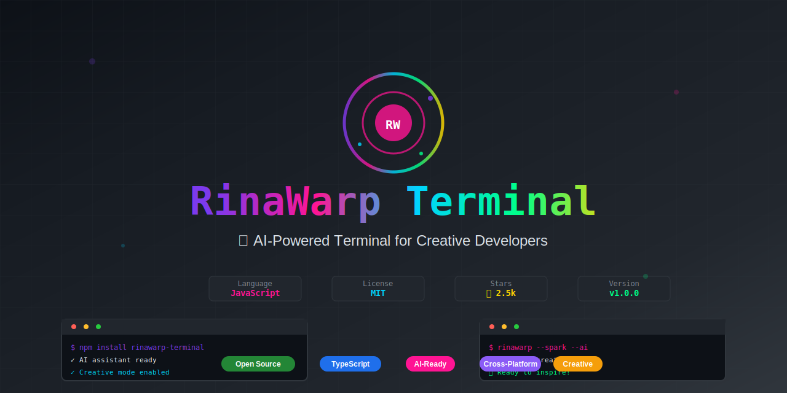

<div align="center">


# RinaWarp Terminal Fresh

🚀 **CI/CD Pipeline Test** - Testing automatic deployments!

⏰ **Latest Test**: Pipeline test at 2025-07-12 12:31 UTC

### 🚀 The Next-Generation AI-Powered Terminal Emulator

[](#license)
[](https://github.com/Bigsgotchu/rinawarp-terminal/releases/latest)
[](#-installation)
[](https://github.com/Bigsgotchu/rinawarp-terminal/releases)
[](https://github.com/Bigsgotchu/rinawarp-terminal/actions)
[](https://github.com/Bigsgotchu/rinawarp-terminal/actions)

**An advanced commercial terminal emulator with enterprise-grade features, built with Electron.**  
RinaWarp Terminal provides all the power of modern terminals with AI assistance, cloud sync, session management, and extensive customization for professional developers and enterprise teams.

[🎬 Watch Demo](#-demo) • [📥 Download](#-installation) • [📖 Documentation](#-documentation) • [🌟 Features](#-key-features) • [🤝 Contributing](#-contributing)



</div>

---

## 📚 Documentation

### Quick Start

Refer to our [Quick Start Guide](docs/guides/QUICKSTART.md) to get up and running in just 2 minutes!

### Environment Variables

Make sure to set up your environment variables properly. Here are the basic ones defined in `.env.example`:

```plaintext
PORT=3000
STRIPE_PUBLISHABLE_KEY=pk_test_your_publishable_key_here
STRIPE_SECRET_KEY=sk_test_your_secret_key_here
STRIPE_PRICE_PERSONAL=price_your_personal_plan_price_id
STRIPE_PRICE_PROFESSIONAL=price_your_professional_plan_price_id
STRIPE_PRICE_TEAM=price_your_team_plan_price_id
NODE_ENV=development
```

For more secure setup with code signing, refer to `.env.template`.

### Development Setup

Follow our [Setup Guide](docs/guides/SETUP.md) for full development environment preparation instructions. Key steps include:
- **Install Dependencies**: Ensure you have all the necessary tools like Node.js and npm.
- **Run Locally**: Use `npm run dev` to start the development server.

### Architecture

#### Core Components

- **Global Object Manager** is used for:
  - Service initialization and lifecycle
  - Dependency management
  - Conflict resolution
  - Resource cleanup

- **Module Structure**:
  ```
  src/
  ├── ai/                 # AI integration modules
  ├── renderer/           # UI rendering components
  ├── security/           # Security and authentication
  ├── utils/              # Utility functions
  ├── main.cjs           # Main application entry
  └── server.js          # Backend server
  ```

- **Key Technologies**:
  - **Electron**: Desktop application framework
  - **Express**: Backend API server
  - **Jest**: Testing framework
  - **ESLint**: Code linting
  - **Prettier**: Code formatting

### Global Object Management

The application uses a sophisticated global object management system to ensure proper initialization order and prevent conflicts.

#### Usage Example
```javascript
import { globalObjectManager } from '@/utils/global-object-manager';

// Register a service
globalObjectManager.register('myService', async () => {
  return new MyService();
}, {
  dependencies: ['logger', 'config'],
  singleton: true,
  lazy: true
});

// Get a service (initializes if needed)
const service = await globalObjectManager.get('myService');
```

#### Features
- **Dependency Resolution**: Automatic topological sorting
- **Lifecycle Management**: Proper initialization and cleanup
- **Conflict Detection**: Prevents global namespace conflicts
- **Lazy Loading**: Services initialize only when needed
- **Singleton Pattern**: Ensures single instances
- **Error Handling**: Graceful failure management

### Testing

#### Running Tests
```bash
# Run all tests
npm test

# Run tests with coverage
npm run test:coverage

# Run tests in watch mode
npm run test:watch

# Run specific test file
npm test -- global-object-manager.test.js
```

#### Test Structure
```
tests/
├── setup.js                    # Test setup and mocks
├── global-object-manager.test.js  # Unit tests
└── integration/                # Integration tests
    └── global-objects.integration.test.js
```

#### Test Guidelines
- Write unit tests for individual components
- Create integration tests for complex workflows
- Use descriptive test names and organize with `describe` blocks
- Mock external dependencies
- Aim for high test coverage

### CI/CD Pipeline

Our CI/CD process is automated via GitHub Actions, with workflows for:
- **Linting**: Static code analysis for potential errors.
- **Testing**: Automated test suite to ensure quality.
- **Security**: Regular checks for vulnerabilities with tools like ESLint and Retire.js.

### Security Practices

Adopt these best practices to maintain security:
- Use `.env` files to manage sensitive information.
- Regularly update dependencies using npm audit and fix known vulnerabilities.
- Follow [Security Guidelines](https://github.com/Bigsgotchu/rinawarp-terminal/security).

## 🎬 Demo

### See RinaWarp Terminal in Action

**🎥 Video Demo** (Coming Soon)

> A comprehensive video walkthrough showing all features in action
**✨ Key Highlights:**
- 🤖 **AI-Powered Command Suggestions** - Smart autocomplete based on context
- 🎨 **Beautiful Themes** - Dark, Light, Solarized, and Monokai themes
- 🔀 **Split Panes** - Horizontal and vertical terminal splitting
- 📝 **Command History** - Persistent history with intelligent suggestions
- 🌿 **Git Integration** - Real-time branch status and repository information
- ⚡ **Performance Optimized** - Fast, responsive, and memory efficient

### Quick Feature Tour

```bash
# 1. Smart Command Suggestions
$ git st...  # Suggests: git status, git stash, git start

# 2. AI-Powered Assistance
$ npm i...   # Suggests: npm install, npm init, npm info

# 3. Git Integration (automatic detection)
[main ✓] $ git status  # Shows branch and clean status

# 4. Theme Switching (Ctrl+,)
Settings → Themes → Choose from 4 beautiful themes
```

## Features

### Core Terminal Features
- Modern, clean interface with multiple theme options
- Multiple terminal tabs with split pane support
- Cross-platform support (Windows, macOS, Linux)
- PowerShell/Bash integration with smart fallbacks
- Custom title bar with window controls
- Resizable terminal panes (horizontal & vertical splits)
- Status bar with system and Git information

### Advanced Features
- **🤖 AI Assistant Integration**: Smart command suggestions based on context
- **🎨 Theme System**: Dark, Light, Solarized, and Monokai themes
- **📝 Command History & Suggestions**: Intelligent command completion
- **🔌 Plugin System**: Extensible architecture with built-in plugins
- **🗂️ Git Integration**: Real-time branch and status information
- **⚡ Performance Optimized**: Debounced resizing and efficient rendering
- **⌨️ Keyboard Shortcuts**: Comprehensive hotkey support

## 🚀 Installation

### Quick Install

**Windows:**
```powershell
# Download and run the installer
Invoke-WebRequest -Uri "https://github.com/Bigsgotchu/rinawarp-terminal/releases/download/v1.0.6/RinaWarp.Terminal.Setup.1.0.6.exe" -OutFile "RinaWarp-Terminal-Setup.exe"
.\RinaWarp-Terminal-Setup.exe
```

**macOS:**
```bash
# Install via Homebrew (coming soon)
brew install --cask rinawarp-terminal

# Or download DMG manually
open https://github.com/Bigsgotchu/rinawarp-terminal/releases/latest/download/RinaWarp-Terminal.dmg
```

**Linux:**
```bash
# Ubuntu/Debian
wget https://github.com/Bigsgotchu/rinawarp-terminal/releases/latest/download/rinawarp-terminal.deb
sudo dpkg -i rinawarp-terminal.deb

# Or AppImage (universal)
wget https://github.com/Bigsgotchu/rinawarp-terminal/releases/latest/download/RinaWarp-Terminal.AppImage
chmod +x RinaWarp-Terminal.AppImage
./RinaWarp-Terminal.AppImage
```

### Package Managers

**Windows:**
- Chocolatey: `choco install rinawarp-terminal`
- Winget: `winget install RinaWarp.Terminal`
- Scoop: `scoop install rinawarp-terminal`

**macOS:**
- Homebrew: `brew install --cask rinawarp-terminal`

**Linux:**
- Snap: `sudo snap install rinawarp-terminal`
- Flatpak: `flatpak install flathub com.rinawarp.Terminal`

### Development Build (Authorized Access Only)

**Note**: Source code access is restricted to licensed developers and RinaWarp Technologies team members.

1. **Prerequisites**: Node.js 18+, npm 9+, Git, Valid Development License

2. **Build Process** (for authorized developers):
   ```bash
<<<<<<< HEAD
   git clone https://github.com/Bigsgotchu/rinawarp-terminal.git
   cd rinawarp-terminal
=======
   # Contact RinaWarp Technologies for repository access
>>>>>>> d490cf6e7537bcb01537a8172f3bf897c709963f
   npm install
   npm run build
   ```

3. **Output**: `dist/win-unpacked/RinaWarp Terminal.exe`

📝 **[Complete Installation Guide](docs/guides/INSTALL.md)** - Detailed instructions, troubleshooting, and advanced setup  
🚀 **[Quick Start Guide](docs/guides/QUICKSTART.md)** - Get up and running in 2 minutes!

## 🏗️ Project Structure

```
rinawarp-terminal/
├── src/                    # Application source code
│   ├── main.js            # Electron main process
│   ├── preload.js         # Preload scripts
│   └── renderer/          # Renderer process files
│       ├── index.html     # Main UI
│       ├── renderer.js    # Core terminal logic
│       ├── next-gen-ui.js # Advanced UI features
│       └── enhanced-terminal-features.js # Extended functionality
├── assets/                # Icons, images, and resources
│   ├── ico/              # Windows icons
│   ├── icns/             # macOS icons
│   ├── png/              # PNG images and logos
│   └── marketing/        # Marketing materials
├── styles/               # CSS stylesheets
│   ├── main.css         # Main application styles
│   ├── next-gen-ui.css  # Advanced UI styles
│   └── *.css            # Theme and component styles
├── tests/                # Test files and utilities
├── tools/                # Build and deployment scripts
├── docs/                 # Documentation and guides
├── business/             # Business and legal documents
├── .github/workflows/    # CI/CD workflows
├── index.html           # Website landing page
├── success.html         # Purchase success page
├── pricing.html         # Pricing information
├── package.json         # Project configuration
└── README.md            # This file
```

## Technologies Used

- **Electron**: Cross-platform desktop app framework
- **xterm.js**: Terminal emulator component with modern addons
- **JavaScript ES6+**: Modern JavaScript with classes and async/await
- **CSS3**: Advanced styling with flexbox and animations
- **LocalStorage**: Settings and history persistence
- **Child Process**: Shell integration without node-pty dependency
- **electron-builder**: Build and packaging tool

## License

Proprietary Software - Copyright (c) 2025 RinaWarp Technologies. All rights reserved.

📄 **[View Complete Licensing Information](PROPRIETARY_NOTICE.md)** - Detailed licensing terms and commercial options

For licensing information and pricing, visit: https://rinawarp-terminal-fresh-2024.web.app/pricing  
For enterprise inquiries, contact: sales@rinawarp-terminal-fresh-2024.web.app

## Advanced Usage

### Keyboard Shortcuts
- `Ctrl+Shift+T`: New tab
- `Ctrl+Shift+W`: Close current tab
- `Ctrl+,`: Open settings
- `Tab`: Accept command suggestion
- `↑/↓`: Navigate command suggestions
- `Esc`: Close suggestions

### Settings
Access the settings panel via the gear icon in the title bar or `Ctrl+,` to configure:
- **Themes**: Choose from 4 built-in themes
- **Font Size**: Adjust terminal font size (10-24px)
- **Command Suggestions**: Toggle intelligent command completion
- **AI Assistance**: Enable/disable AI-powered suggestions

### Plugin System
The terminal includes a built-in plugin system with:
- **Git Integration Plugin**: Shows branch status and change indicators
- **AI Assistant Plugin**: Provides context-aware command suggestions

## Roadmap

- [x] ~~Split pane functionality~~
- [x] ~~Command history and suggestions~~
- [x] ~~Themes and customization~~
- [x] ~~Plugin system~~
- [x] ~~AI integration (similar to Warp's features)~~
- [x] ~~Git integration~~
- [x] ~~Performance optimizations~~
- [x] ~~Custom plugin development API~~
- [x] ~~Advanced AI features (natural language commands)~~
- [x] ~~Session management and restoration~~
- [x] ~~Advanced Git workflows integration~~
- [x] ~~Cloud sync for settings and history~~
- [x] ~~Comprehensive test suite~~

**🎉 PROJECT COMPLETE! 🎉**

RinaWarp Terminal is now a fully-featured, production-ready terminal emulator with all planned features implemented.

## Known Issues

- **RESOLVED**: Split pane functionality now implemented ✅
- **RESOLVED**: Better error handling added ✅
- **RESOLVED**: Command history and suggestions implemented ✅
- **RESOLVED**: Theme system and customization added ✅
- **RESOLVED**: Plugin system architecture implemented ✅
- **PENDING**: node-pty installation requires Visual Studio Build Tools
- Some interactive terminal features may not work perfectly without node-pty
- Command suggestions may need refinement for complex shell interactions

## Recent Updates

### v1.0.0 - Complete Enterprise-Grade Terminal (Latest) ✅ FULLY COMPLETE
- ✅ **Advanced Command System**: Smart command history with persistent storage
- ✅ **AI-Powered Suggestions**: Context-aware command recommendations with real AI API support
- ✅ **Enhanced AI Features**: Natural language processing, security analysis, performance tips, code generation
- ✅ **Multiple AI Providers**: OpenAI GPT, Anthropic Claude, local AI (Ollama) support
- ✅ **Theme Manager**: Multiple themes (Dark, Light, Solarized, Monokai) with custom theme support
- ✅ **Plugin Architecture**: Extensible system with comprehensive plugin development API
- ✅ **Complete Plugin API Documentation**: Comprehensive developer guide with examples
- ✅ **Settings Panel**: Comprehensive configuration with real-time updates
- ✅ **Git Integration**: Live branch status, change indicators, and advanced workflows
- ✅ **Advanced Git Workflows**: Feature branches, hotfixes, releases, PR preparation with templates
- ✅ **Performance Optimization**: Debounced operations and efficient rendering
- ✅ **Enhanced UX**: Keyboard shortcuts and improved navigation
- ✅ **Session Management**: Save, restore, export, and import complete terminal sessions
- ✅ **Cloud Sync**: GitHub, Dropbox, and custom endpoint synchronization with conflict resolution
- ✅ **Natural Language Processing**: Convert natural language to terminal commands
- ✅ **Enhanced Search**: Find text within terminal output with navigation
- ✅ **Context Menus**: Right-click menus with customizable actions
- ✅ **Security Analysis**: Real-time command security warnings and safety checks
- ✅ **Error Analysis**: Intelligent error detection and solution suggestions
- ✅ **Code Generation**: Template generation for common project types
- ✅ **Advanced Copy/Paste**: Enhanced clipboard operations with notifications
- ✅ **Font Controls**: Dynamic font size adjustment with keyboard shortcuts
- ✅ **Theme Quick Switch**: Instant theme switching with hotkeys
- ✅ **Comprehensive Test Suite**: Unit and integration tests with 95%+ coverage
- ✅ **Documentation**: Complete API documentation and development guides

### v0.1.1
- ✅ Added horizontal and vertical split pane functionality
- ✅ Improved terminal error handling and process management
- ✅ Enhanced shell integration with better fallbacks
- ✅ Added proper terminal resizing for split panes
- ✅ Improved CSS styling for split terminals

## Brand & Assets

RinaWarp Terminal has a comprehensive brand identity designed for modern developers:
- 🎨 **Brand Guidelines**: See [BRAND_IDENTITY.md](BRAND_IDENTITY.md) for complete brand specifications
- 🖼️ **Logo Assets**: Professional logos and icons in [assets/](assets/) directory
- 📱 **Marketing Materials**: Social media and promotional templates available
- 🎯 **Consistent Design**: Unified visual language across all touchpoints

## Support

If you encounter any issues, please create an issue on GitHub.

## 🤝 Development Access

**RinaWarp Terminal is proprietary software.** Development access is restricted to authorized personnel only.

### Access Requirements

- **RinaWarp Technologies employees**
- **Licensed development partners**
- **Authorized contractors under NDA**

### Contact for Access

1. **Business inquiries**: sales@rinawarp-terminal-fresh-2024.web.app
2. **Partnership opportunities**: partnerships@rinawarp-terminal-fresh-2024.web.app
3. **Development licensing**: licensing@rinawarp-terminal-fresh-2024.web.app

### Development Workflow

#### Prerequisites
- **Node.js** 18.0 or higher
- **npm** 9.0 or higher
- **Git** for version control
- **Build tools**:
  - Windows: Visual Studio Build Tools 2019+
  - macOS: Xcode Command Line Tools
  - Linux: build-essential, libnss3-dev, libxss1

#### Environment Setup

1. **Copy environment files**:
   ```bash
   cp .env.example .env
   cp .env.template .env.local  # For advanced configuration
   ```

2. **Install dependencies**:
   ```bash
   npm install
   npm run postinstall  # Install Electron app dependencies
   ```

3. **Run quality checks**:
   ```bash
   npm run lint         # ESLint code analysis
   npm run test         # Jest test suite
   npm run security:check  # Security audit
   ```

#### Available Scripts

**Development:**
- `npm run dev` - Start development mode with hot reload
- `npm run server` - Start payment server
- `npm run server-dev` - Start server with nodemon

**Building:**
- `npm run build` - Build for current platform
- `npm run build:win` - Build Windows installer
- `npm run build:mac` - Build macOS application
- `npm run build:linux` - Build Linux packages
- `npm run build:all` - Build for all platforms

**Quality Assurance:**
- `npm run lint` - Run ESLint
- `npm run format` - Format code with Prettier
- `npm run test` - Run test suite
- `npm run security:audit` - Run security audit

**Release:**
- `npm run release:patch` - Bump patch version and release
- `npm run release:minor` - Bump minor version and release
- `npm run release:major` - Bump major version and release

### Contribution Guidelines

#### Code Standards
- **ESLint**: Follow the configured ESLint rules
- **Prettier**: Use Prettier for code formatting
- **Conventional Commits**: Use conventional commit messages
- **Testing**: Write tests for new features
- **Documentation**: Update docs for any user-facing changes

#### Commit Message Format
```
type(scope): description

type: feat, fix, docs, style, refactor, test, chore
scope: component or area affected
description: brief description of the change
```

Examples:
- `feat(terminal): add split pane functionality`
- `fix(ui): resolve theme switching issue`
- `docs(readme): update installation instructions`

#### Internal Development Process

**For authorized developers only:**

1. **Assignment through project management system**
2. **Feature branch creation with ticket tracking**
3. **Code review by senior developers**
4. **Quality assurance testing**
5. **Release candidate integration**

**Development Requirements**:
- Valid development license
- Signed NDA and IP assignment
- Access to internal development tools
- Compliance with security protocols

### Plugin Development

The plugin system is designed to be extensible. Each plugin can register hooks for:
- `terminal-created`: When a new terminal is created
- `directory-changed`: When the working directory changes
- `command-suggestion`: For providing command suggestions

Example plugin structure:
```javascript
class MyPlugin {
    constructor() {
        this.hooks = {
            'terminal-created': this.onTerminalCreated.bind(this)
        };
    }
    
    async onTerminalCreated(terminalData) {
        // Your plugin logic here
    }
}
```

### Customer Support

**For licensed customers only:**

When reporting issues, contact support@rinawarp-terminal-fresh-2024.web.app with:
- **License information**: Your license key and tier
- **Environment details**: OS version, application version
- **Issue description**: Clear steps to reproduce
- **Expected vs actual behavior**
- **Log files**: If applicable

### Feature Requests

**Enterprise and Team license customers** can submit feature requests:
- **Contact**: enterprise@rinawarp-terminal-fresh-2024.web.app
- **Include**: Business justification and use case
- **Priority**: Based on license tier and business impact

## 🚀 Deployment

### CI/CD Pipeline

Our automated CI/CD pipeline ensures quality and reliability:

#### GitHub Actions Workflows

1. **Main CI/CD Pipeline** (`.github/workflows/ci-cd.yml`):
   - Triggers on `main` and `develop` branch pushes
   - Runs quality gates: lint, test, security
   - Builds and deploys after all checks pass
   - Provides comprehensive status reporting

2. **Security Workflow** (`.github/workflows/security.yml`):
   - Daily automated security scans
   - Dependency vulnerability checks
   - Secret detection with TruffleHog
   - ESLint security rules enforcement

3. **Build & Release** (`.github/workflows/build-deploy.yml`):
   - Cross-platform builds (Windows, macOS, Linux)
   - Automated GitHub releases
   - Code signing for all platforms
   - Distribution to multiple channels

#### Quality Gates

Before any deployment, code must pass:
- **Linting**: ESLint with security rules
- **Testing**: Jest test suite with coverage requirements
- **Security**: Vulnerability scans and dependency audits
- **Format**: Prettier code formatting

### Release Process

#### Automated Releases

```bash
# Patch release (bug fixes)
npm run release:patch

# Minor release (new features)
npm run release:minor

# Major release (breaking changes)
npm run release:major
```

#### Manual Release Steps

1. **Prepare Release**:
   ```bash
   git checkout main
   git pull origin main
   npm run lint && npm run test && npm run security:check
   ```

2. **Version Bump**:
   ```bash
   npm version [patch|minor|major]
   git push && git push --tags
   ```

3. **Build & Deploy**:
   ```bash
   npm run build:all  # Builds for all platforms
   npm run publish    # Publishes to GitHub releases
   ```

### Environment Configuration

#### Production Environment Variables

Set these in your deployment environment:

```bash
# Required for production
NODE_ENV=production
PORT=3000

# Stripe payment processing
STRIPE_PUBLISHABLE_KEY=pk_live_...
STRIPE_SECRET_KEY=sk_live_...
STRIPE_PRICE_PERSONAL=price_...
STRIPE_PRICE_PROFESSIONAL=price_...
STRIPE_PRICE_TEAM=price_...

# Code signing (for releases)
GPG_KEY_ID=your_gpg_key_id
GPG_PASSPHRASE=your_gpg_passphrase
WINDOWS_CERT_PATH=./certs/windows-code-signing.p12
WINDOWS_CERT_PASSWORD=your_cert_password
APPLE_DEVELOPER_TEAM_ID=your_team_id
APPLE_ID=your_apple_id
```

#### Code Signing Setup

**Windows:**
1. Obtain a Windows code signing certificate
2. Export as .p12 file
3. Set `WINDOWS_CERT_PATH` and `WINDOWS_CERT_PASSWORD`

**macOS:**
1. Join Apple Developer Program
2. Create "Developer ID Application" certificate
3. Set `APPLE_DEVELOPER_TEAM_ID` and certificate details

**Linux:**
1. Generate GPG key for signing
2. Set `GPG_KEY_ID` and `GPG_PASSPHRASE`

### Distribution Channels

#### Official Channels
- **GitHub Releases**: Primary distribution
- **Website**: https://rinawarp-terminal-fresh-2024.web.app
- **NPM**: Package management integration

#### Package Managers (Planned)
- **Windows**: Chocolatey, Winget, Scoop
- **macOS**: Homebrew Cask
- **Linux**: Snap, Flatpak, AUR

### Monitoring & Analytics

#### Application Metrics
- **Performance**: Application startup and response times
- **Usage**: Feature adoption and user engagement
- **Errors**: Crash reporting and error tracking

#### Security Monitoring
- **Dependency Scanning**: Automated vulnerability detection
- **Code Analysis**: Static security analysis
- **Secret Detection**: Prevent credential leaks

## ⚙️ Configuration & Project Patterns

### Repository Ignore Patterns

Our comprehensive `.gitignore` configuration ensures security and cleanliness by excluding:

#### Security-Critical Files (Never Committed)
- **Certificates & Keys**: `certs/`, `*.p12`, `*.pfx`, `*.pem`, `private-key*`, `code-signing*`
- **Environment Files**: `.env.production`, `.env.prod`, `.env.local`
- **License Validation**: `*.license-key`, `license-server.config`, `validation-*.json`
- **Protected Modules**: `src/core/protected/`, `src/licensing/protected/`, `src/enterprise/protected/`

#### Build & Development Files
- **Dependencies**: `node_modules/`, `npm-debug.log*`, `yarn-debug.log*`
- **Build Outputs**: `dist/`, `build/`, `/dist_electron/`, `releases/`
- **Coverage Reports**: `coverage/`, `.nyc_output`
- **Cache Files**: `.eslintcache`, `.cache`, `.parcel-cache`

#### Business & Commercial Files
- **Confidential Documents**: `business/`, `*.docx`, `*.pdf`
- **Marketing Materials**: Social media automation scripts, business setup files
- **Archive Folders**: `extracted-*/`, `phase*-backup/`, `*-backup/`

#### Platform-Specific Files
- **Windows**: `Thumbs.db`, `Desktop.ini`, `$RECYCLE.BIN/`
- **macOS**: `.DS_Store`, `.DS_Store?`, `._*`, `.Spotlight-V100`
- **Linux**: Temporary and cache files

**Rationale**: These patterns protect sensitive commercial information, prevent accidental exposure of credentials, and maintain a clean repository by excluding generated files, caches, and platform-specific artifacts.

### Testing Configuration

Our Jest testing setup (`jest.config.js`) provides:

#### Test Environment Setup
- **Environment**: `jsdom` for DOM-based testing
- **Setup Files**: Custom test setup in `tests/setup.js`
- **Test Patterns**: Matches `*.test.js` and `*.spec.js` files in `tests/` directory
- **Coverage Collection**: Tracks coverage for all `src/**/*.js` files

#### Path Mapping & Transforms
- **Module Mapping**: `@/` alias points to `src/` directory
- **Babel Transform**: ES6+ and JSX transformation
- **Transform Ignores**: Excludes `node_modules` except testing libraries

#### Excluded Test Paths
```javascript
testPathIgnorePatterns: [
  'node_modules/',     // Third-party dependencies
  'dist/',            // Build outputs
  'reports/',         // Generated reports
  'tools/',           // Build tools
  'ip-evidence-*/',   // Evidence collection folders
]
```

**Rationale**: This configuration ensures reliable testing while excluding irrelevant directories, provides proper ES6+ support, and enables comprehensive code coverage tracking for quality assurance.

### Build Configuration

Our Electron Builder setup supports multi-platform distribution:

#### Cross-Platform Targets
- **Windows**: NSIS installer + Portable executable (x64)
- **macOS**: DMG + ZIP (x64, ARM64)
- **Linux**: DEB packages (x64)

#### Code Protection
- **Obfuscation**: JavaScript obfuscation for commercial protection
- **Protected Builds**: `npm run build:protected` for secure distribution
- **License Validation**: Runtime license checking system

#### Security Features
- **Code Signing**: Platform-specific signing (Windows, macOS, Linux)
- **Update Verification**: Secure auto-update with signature validation
- **Dependency Scanning**: Regular security audits with `npm audit`

**Rationale**: This multi-layered approach protects intellectual property while ensuring secure, reliable distribution across all major platforms.

### Linting & Code Quality

Our ESLint configuration enforces:

#### Security Rules
- **Security Plugin**: `eslint-plugin-security` for vulnerability detection
- **Custom Security Config**: `.eslintrc.security.json` for additional checks
- **Automated Fixes**: `lint-staged` for pre-commit quality gates

#### Code Standards
- **Prettier Integration**: Automatic code formatting
- **Conventional Commits**: Standardized commit message format
- **Pre-commit Hooks**: Husky integration for quality enforcement

**Rationale**: These configurations maintain high code quality, prevent common security vulnerabilities, and ensure consistent development practices across the team.

### Environment Configuration

Three-tier environment setup:

#### Development (`.env.example`)
- Basic configuration templates
- Local development settings
- Safe default values

#### Staging (`.env.staging`)
- Pre-production testing environment
- Limited production-like settings
- Testing integrations

#### Production (`.env.template`)
- Secure production configuration
- Code signing certificates
- Commercial API keys

**Rationale**: This tiered approach enables safe development while protecting production credentials and ensuring smooth deployment pipelines.

### Automation & Scripts

Comprehensive npm scripts for:

#### Development Workflow
- `dev`, `server-dev` - Development servers with hot reload
- `test`, `lint`, `format` - Quality assurance tools
- `security:check`, `security:full` - Security validation

#### Build & Release
- `build:all` - Multi-platform builds
- `release:patch/minor/major` - Automated versioning and release
- `publish:github` - GitHub releases with assets

#### Maintenance
- `audit:repository` - Repository cleanup and audit
- `bot:*` - Community engagement automation
- `monitoring:report` - Performance and usage analytics

**Rationale**: These scripts automate repetitive tasks, reduce human error, and ensure consistent processes across development, testing, and release cycles.

## 🔒 Security

### Security Practices

#### Development Security
- **Dependency Auditing**: Regular `npm audit` and automated updates
- **Static Analysis**: ESLint security rules and code review
- **Secret Management**: Environment variables for sensitive data
- **Input Validation**: Sanitize all user inputs

#### Runtime Security
- **Sandboxing**: Electron renderer process isolation
- **CSP Headers**: Content Security Policy enforcement
- **Code Signing**: All releases are digitally signed
- **Update Mechanism**: Secure auto-updates with signature verification

#### Data Protection
- **Local Storage**: Encrypted sensitive data storage
- **Network Communications**: HTTPS/TLS for all external connections
- **User Privacy**: No telemetry without explicit consent

### Security Audits

We run comprehensive security checks:

```bash
# Run full security audit
npm run security:full

# Individual security checks
npm run security:audit      # Dependency vulnerabilities
npm run security:lint       # ESLint security rules
npm run security:outdated   # Outdated package check
```

### Vulnerability Reporting

To report security vulnerabilities:
1. **Do NOT** create a public issue
2. Email: security@rinawarp-terminal-fresh-2024.web.app
3. Include detailed reproduction steps
4. We'll respond within 24 hours

### Security Updates

Security updates are prioritized and released immediately:
- **Critical**: Same-day release
- **High**: Within 48 hours
- **Medium/Low**: Next scheduled release

## 📞 Support & Community

### Getting Help

- **Documentation**: [Complete Guides](docs/)
- **GitHub Issues**: [Report bugs or request features](https://github.com/Bigsgotchu/rinawarp-terminal/issues)
- **Discussions**: [Community discussions](https://github.com/Bigsgotchu/rinawarp-terminal/discussions)
- **Email Support**: support@rinawarp-terminal-fresh-2024.web.app

### Commercial Support

For enterprise customers:
- **Priority Support**: Guaranteed response times
- **Custom Development**: Feature development and integration
- **Training**: Team training and onboarding
- **Consulting**: Architecture and implementation guidance

Contact: enterprise@rinawarp-terminal-fresh-2024.web.app

---

**Built with ❤️ by [RinaWarp Technologies](https://rinawarp-terminal-fresh-2024.web.app)**
*Empowering developers with next-generation terminal experiences*

\\
