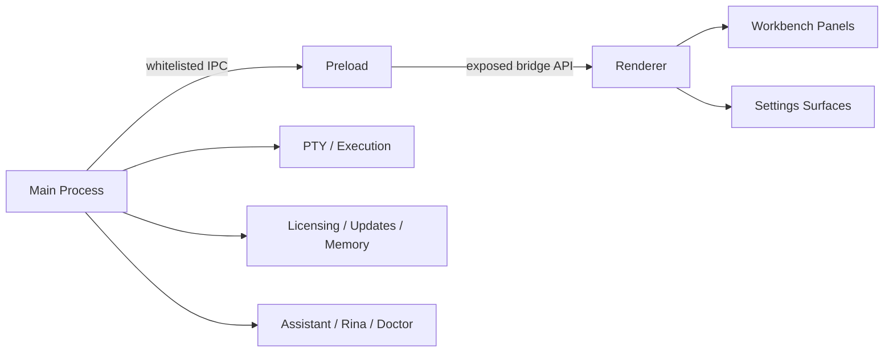
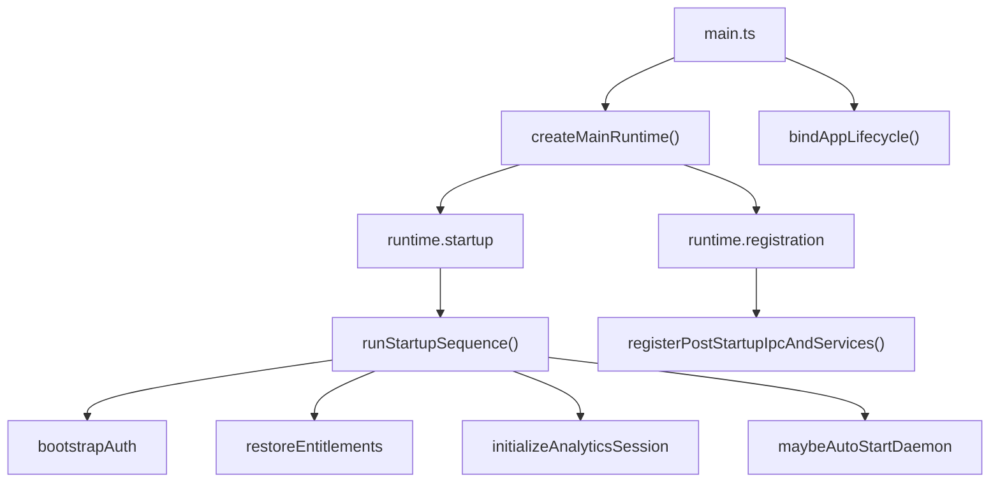

# Rinawarp Terminal Pro Architecture

## TL;DR

`terminal-pro` is an Electron app with a strict preload boundary, a large main-process composition root, and a renderer organized around workbench panels, settings surfaces, and action/service modules.

The highest-signal architecture files today are [`src/main.ts`](./src/main.ts), [`src/preload.ts`](./src/preload.ts), and [`src/main/startup/createMainRuntime.ts`](./src/main/startup/createMainRuntime.ts).

The new framework extraction now also lives in:

- [`../../packages/runtime-core/src/index.ts`](../../packages/runtime-core/src/index.ts)
- [`../../packages/runtime-contracts/src/index.ts`](../../packages/runtime-contracts/src/index.ts)
- [`src/main/startup/bootstrapFrameworkRuntime.ts`](./src/main/startup/bootstrapFrameworkRuntime.ts)

## Architectural Model

Rinawarp Terminal Pro follows a layered, progressively modular architecture with a central composition root that is being decomposed into a more plugin-oriented runtime.

### Layers

1. Core Runtime
   Composition and lifecycle orchestration.
   Shared kernel/container primitives are now being extracted into `packages/runtime-core`.
2. Platform
   Electron window lifecycle, IPC primitives, and OS access.
   Electron-specific adapters are starting to move into `packages/runtime-platform-electron`.
3. Feature Domains
   Licensing, workspace, memory, planning, diagnostics, agentd, team, and updates.
   The first typed plugin slices now exist in `packages/runtime-feature-*`.
4. API Surface
   IPC handlers that expose feature capabilities to the renderer.
5. Assistant Layer
   Cross-domain orchestration for Rina and doctor flows.
6. Renderer
   UI surfaces, panels, settings, state, and user interactions.

## Design Goals

- Strong process isolation aligned with the Electron security model
- Explicit IPC surface as the public API boundary between renderer and main
- Modular domain separation for licensing, memory, planning, diagnostics, and agent execution
- Progressive decomposition of the composition layer into clearer runtime units
- Testability of core logic independent of Electron where practical

## Dependency Rules

- Renderer may only access main-process capabilities through preload-exposed IPC
- Preload may only expose explicitly whitelisted APIs
- IPC layer depends on feature/domain logic and should not own business rules
- Feature/domain logic should not depend on renderer code
- Feature/domain logic should avoid depending directly on IPC registration modules
- Platform modules should remain thin and avoid absorbing domain logic
- Core runtime composition should wire services together, not become the implementation home for those services

## What This App Is

Rinawarp Terminal Pro is a desktop application that combines:

- Electron shell and window lifecycle management
- a main-process orchestration layer for licensing, IPC, PTY execution, planning, diagnostics, updates, and team features
- an assistant layer for Rina/doctor flows
- a renderer workbench with panels, settings surfaces, and reply rendering

## Process Boundaries

There are three main runtime zones:

1. Main process
   Owns application startup, IPC registration, PTY/process execution, file-system access, diagnostics, updates, licensing, and assistant orchestration.
2. Preload
   Exposes a restricted IPC surface from Electron to the renderer through explicit channel whitelists.
3. Renderer
   Owns UI state, workbench surfaces, settings panels, action binding, and rendering of assistant/plan/run responses.



## Boot Sequence

The app starts in [`src/main.ts`](./src/main.ts), which imports the main-process dependencies and delegates most assembly to the startup modules.

Current boot flow:

1. Build environment constants, feature flags, and shared helpers in [`src/main.ts`](./src/main.ts)
2. Assemble grouped runtime domains in [`src/main/startup/createMainRuntime.ts`](./src/main/startup/createMainRuntime.ts)
3. Run startup steps from [`src/main/startup/startupSequence.ts`](./src/main/startup/startupSequence.ts)
4. Bind Electron lifecycle behavior in [`src/main/startup/appLifecycleBinder.ts`](./src/main/startup/appLifecycleBinder.ts)
5. Register post-startup IPC/services in [`src/main/startup/registerPostStartupIpcAndServices.ts`](./src/main/startup/registerPostStartupIpcAndServices.ts)



## Runtime Lifecycle Phases

1. Composition Phase
   `createMainRuntime()` assembles services, grouped dependencies, and runtime domains.
2. Initialization Phase
   `bootstrapAuth`, `restoreEntitlements`, and `initializeAnalyticsSession` establish persisted state and runtime context.
3. Activation Phase
   `maybeAutoStartDaemon` and `bindAppLifecycle` activate long-lived runtime behavior.
4. Exposure Phase
   `registerPostStartupIpcAndServices()` exposes capabilities over IPC after core services are available.
5. Runtime Phase
   Normal app behavior is driven by IPC requests, assistant flows, PTY activity, diagnostics, and renderer interactions.
6. Shutdown Phase
   Shutdown is still mostly implicit today and should become more explicit over time.

## Main Architectural Layers

### 1. Entry and Build Context

These define how the project builds, packages, and starts:

- [`package.json`](./package.json)
- [`tsconfig.json`](./tsconfig.json)
- [`electron-builder.yml`](./electron-builder.yml)
- [`src/main.ts`](./src/main.ts)
- [`src/preload.ts`](./src/preload.ts)

### 2. Composition Layer

This is the most important current review area. It explains how the app is wired together.

- [`src/main/startup/createMainRuntime.ts`](./src/main/startup/createMainRuntime.ts)
- [`src/main/startup/startupSequence.ts`](./src/main/startup/startupSequence.ts)
- [`src/main/startup/registerPostStartupIpcAndServices.ts`](./src/main/startup/registerPostStartupIpcAndServices.ts)
- [`src/main/startup/appLifecycleBinder.ts`](./src/main/startup/appLifecycleBinder.ts)
- [`src/main/window/windowLifecycle.ts`](./src/main/window/windowLifecycle.ts)

### 3. IPC Surface

This is the cross-process API layer and the main security exposure surface.

- [`src/main/ipc/registerConsolidatedIpcHandlers.ts`](./src/main/ipc/registerConsolidatedIpcHandlers.ts)
- [`src/main/ipc/registerAgentExecutionIpc.ts`](./src/main/ipc/registerAgentExecutionIpc.ts)
- [`src/main/ipc/registerMemoryIpc.ts`](./src/main/ipc/registerMemoryIpc.ts)
- [`src/main/ipc/registerUpdateIpc.ts`](./src/main/ipc/registerUpdateIpc.ts)
- [`src/main/ipc/registerAnalyticsIpc.ts`](./src/main/ipc/registerAnalyticsIpc.ts)
- [`src/preload.ts`](./src/preload.ts)

### 4. Core Domain Logic

These files hold most of the business/runtime logic:

- [`src/main/agentd/ipcWrappers.ts`](./src/main/agentd/ipcWrappers.ts)
- [`src/main/agentd/client.ts`](./src/main/agentd/client.ts)
- [`src/main/pty/runtime.ts`](./src/main/pty/runtime.ts)
- [`src/main/session/sessionHelpers.ts`](./src/main/session/sessionHelpers.ts)
- [`src/main/planning/buildPlan.ts`](./src/main/planning/buildPlan.ts)
- [`src/main/policy/gate.ts`](./src/main/policy/gate.ts)
- [`src/main/memory/memoryStore.ts`](./src/main/memory/memoryStore.ts)
- [`src/main/license/licenseState.ts`](./src/main/license/licenseState.ts)

### 5. Assistant / Rina Orchestration

These files define the AI-oriented orchestration layer:

- [`src/main/assistant/registerRinaIpc.ts`](./src/main/assistant/registerRinaIpc.ts)
- [`src/main/assistant/registerRinaPlanIpc.ts`](./src/main/assistant/registerRinaPlanIpc.ts)
- [`src/main/assistant/doctorIpc.ts`](./src/main/assistant/doctorIpc.ts)
- [`src/main/assistant/chatDoctorIpc.ts`](./src/main/assistant/chatDoctorIpc.ts)
- [`src/main/assistant/miscIpc.ts`](./src/main/assistant/miscIpc.ts)

## Assistant Layer

The assistant layer is a cross-domain orchestration system. It coordinates:

- planning via build-plan helpers
- policy enforcement via the gate layer
- execution via agentd and PTY runtime paths
- diagnostics via doctor-oriented flows

It does not own most domain logic itself. Instead, it composes capabilities from other domains into user-facing AI workflows.

### 6. Renderer UI Layer

These files give the clearest picture of renderer structure:

- [`src/renderer/index.ts`](./src/renderer/index.ts)
- [`src/renderer/bootstrap/initRenderer.ts`](./src/renderer/bootstrap/initRenderer.ts)
- [`src/renderer/shell/workbenchShell.ts`](./src/renderer/shell/workbenchShell.ts)
- [`src/renderer/panels/AgentPanel.ts`](./src/renderer/panels/AgentPanel.ts)
- [`src/renderer/panels/DiagnosticsPanel.ts`](./src/renderer/panels/DiagnosticsPanel.ts)
- [`src/renderer/settings/settingsShellSurface.ts`](./src/renderer/settings/settingsShellSurface.ts)

## Current High-Signal Design Characteristics

### Strengths

- Main-process concerns are increasingly grouped by domain instead of living entirely in one file.
- Preload uses explicit channel whitelists, which makes the renderer boundary auditable.
- Core domains like memory, licensing, planning, PTY runtime, and diagnostics are already separated into their own modules.
- Startup behavior has been split into composition, startup sequence, lifecycle binding, and post-startup registration.

### Current Friction Points

- [`src/main/startup/createMainRuntime.ts`](./src/main/startup/createMainRuntime.ts) is still the primary composition choke point.
- Some contracts in the composition layer still use broad function types, which weakens refactor safety.
- Lifecycle ordering is mostly encoded by execution sequence rather than explicit phase objects.
- The main-process dependency surface is still broad, even though it is now grouped.

## Reviewer Reading Order

If you are reviewing this codebase for architecture first, read in this order:

1. [`package.json`](./package.json)
2. [`src/main.ts`](./src/main.ts)
3. [`src/main/startup/createMainRuntime.ts`](./src/main/startup/createMainRuntime.ts)
4. [`src/main/startup/registerPostStartupIpcAndServices.ts`](./src/main/startup/registerPostStartupIpcAndServices.ts)
5. [`src/main/window/windowLifecycle.ts`](./src/main/window/windowLifecycle.ts)
6. [`src/main/startup/startupSequence.ts`](./src/main/startup/startupSequence.ts)
7. [`src/preload.ts`](./src/preload.ts)
8. [`src/main/ipc/registerAgentExecutionIpc.ts`](./src/main/ipc/registerAgentExecutionIpc.ts)
9. [`src/main/license/licenseState.ts`](./src/main/license/licenseState.ts)
10. [`src/main/memory/memoryStore.ts`](./src/main/memory/memoryStore.ts)
11. [`src/main/planning/buildPlan.ts`](./src/main/planning/buildPlan.ts)
12. [`src/main/policy/gate.ts`](./src/main/policy/gate.ts)
13. [`src/main/assistant/doctorIpc.ts`](./src/main/assistant/doctorIpc.ts)
14. [`src/main/assistant/chatDoctorIpc.ts`](./src/main/assistant/chatDoctorIpc.ts)
15. [`src/renderer/bootstrap/initRenderer.ts`](./src/renderer/bootstrap/initRenderer.ts)
16. [`src/renderer/panels/AgentPanel.ts`](./src/renderer/panels/AgentPanel.ts)

## Suggested Future Shape

This is not the current layout. It is the likely direction if composition keeps getting smaller and clearer:

```text
src/main/
  startup/
    bootstrapAppRuntime.ts
    lifecycleOrchestrator.ts
    installPlugins.ts

  plugins/
    ipc.plugin.ts
    agentd.plugin.ts
    licensing.plugin.ts
    workspace.plugin.ts

  features/
    licensing/
      service.ts
      state.ts
    agentd/
      client.ts
      execution.ts
    planning/
      buildPlan.service.ts
    policy/
      gate.service.ts
    session/
      session.service.ts
```

The reason for that direction is simple: reviewers should be able to understand architecture from the file layout, not reverse-engineer it from wiring.

## Migration Strategy

1. Replace the current large composition root with smaller runtime entry modules such as:
   - `bootstrapAppRuntime.ts`
   - `installPlugins.ts`
   - `lifecycleOrchestrator.ts`
2. Extract major domains into clearer plugin-style modules:
   - `licensing.plugin.ts`
   - `workspace.plugin.ts`
   - `agentd.plugin.ts`
   - `ipc.plugin.ts`
3. Continue replacing broad function types with stricter service interfaces
4. Make lifecycle phases explicit in code, not just in sequencing
5. Reduce the main-process dependency surface through better service grouping and smaller runtime builders

## Quality / Trust Signals

These are useful when evaluating project maturity and async behavior:

- [`tests/playwright.config.ts`](./tests/playwright.config.ts)
- [`tests/agent.test.mjs`](./tests/agent.test.mjs)
- [`tests/streaming.test.mjs`](./tests/streaming.test.mjs)
- [`scripts/continuous-smoke.ts`](./scripts/continuous-smoke.ts)

## Short Review Packet

If you only want to send 10 files to another engineer, send these:

1. [`package.json`](./package.json)
2. [`src/main.ts`](./src/main.ts)
3. [`src/preload.ts`](./src/preload.ts)
4. [`src/main/startup/createMainRuntime.ts`](./src/main/startup/createMainRuntime.ts)
5. [`src/main/startup/startupSequence.ts`](./src/main/startup/startupSequence.ts)
6. [`src/main/startup/registerPostStartupIpcAndServices.ts`](./src/main/startup/registerPostStartupIpcAndServices.ts)
7. [`src/main/window/windowLifecycle.ts`](./src/main/window/windowLifecycle.ts)
8. [`src/main/ipc/registerAgentExecutionIpc.ts`](./src/main/ipc/registerAgentExecutionIpc.ts)
9. [`src/main/license/licenseState.ts`](./src/main/license/licenseState.ts)
10. [`src/main/memory/memoryStore.ts`](./src/main/memory/memoryStore.ts)
