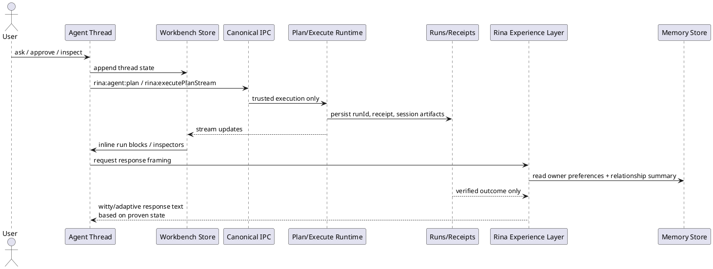
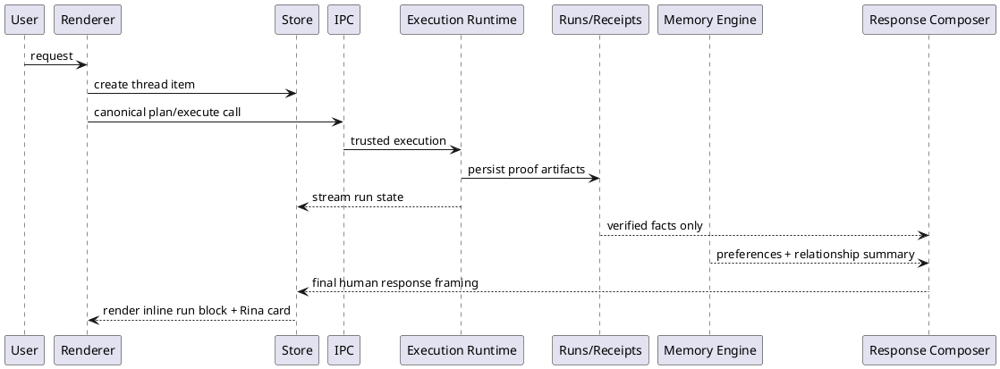

# SPEC-1-RinaWarp Adaptive Trusted Workbench

## Background

RinaWarp Terminal Pro has evolved from a terminal-centered desktop app into an agent-first workbench where the Agent Thread is the primary surface and terminal/runs are supporting inspectors. The architecture already shows strong convergence around trust: one canonical renderer, one canonical IPC path, sender-aware workspace authority, structured runs/receipts, and removal of mock or fallback execution paths.

The remaining product challenge is to ensure that the execution spine and the Rina experience layer are built together rather than separately. In other words, the product must not only execute plans with proof, but also present a coherent, personality-rich, adaptive assistant that feels intelligent from the start. Rina should be able to respond with appropriate tone, summarize results in a human way, surface recovery naturally, and gradually adapt from user interactions while preserving hard guarantees around receipts, run IDs, and trusted execution.

The design therefore needs to validate that:

- the current workbench architecture already supports the trusted execution/proof model end to end, and
- the next phase adds a controlled personality/adaptation layer that is observable, safe, and implementable without creating parallel execution or UI paths.

## Requirements

### Must Have

- **Single trusted execution spine**
  - All user-triggered execution must flow only through the canonical plan/execute/proof path.
  - No parallel execution paths, terminal bypasses, mock handlers, or silent fallbacks.
- **Proof-backed claims**
  - Any build, test, deploy, fix, or diagnostic claim must be backed by `runId` plus receipt/session artifacts.
  - UI must not present success language without proof state.
- **Agent-thread-first UX**
  - Chat is the primary surface.
  - Runs, Terminal, Code, and Diagnostics remain inspectors.
  - Inline run blocks are the default proof surface inside conversation.
- **Cross-session memory/personalization**
  - Rina should retain user preferences across sessions.
  - Memory must include explicit user preferences, inferred working preferences, and relationship/history summaries.
- **Personality layer**
  - Rina should consistently feel witty, sharp, funny, and human-friendly.
  - Personality must affect wording, presentation, pacing, and interaction style, but not weaken trust or proof requirements.
- **Context sensitivity**
  - Rina should “read the room” by adapting to user state and task context:
    - serious when something fails
    - concise during active work
    - more playful when appropriate
    - calm and clear during recovery or errors
- **Owner-only control**
  - Personality/memory controls are not broadly user-tunable in MVP.
  - Only the owner can edit/reset the memory and personalization settings.
- **Workspace-aware proof UX**
  - Runs should default to current workspace scope.
  - Background/session-noise runs should be hidden by default.
  - A visible `Show all` control should reveal everything.
- **Recovery as first-class**
  - Interrupted/restored runs must appear both inline and in inspectors with clear state.
  - Recovery should feel natural in-thread, not like an unrelated system event.
- **Contractor-implementable MVP**
  - Design must be specific enough to implement directly in Electron/main/renderer code with concrete storage, IPC boundaries, and rendering rules.

### Should Have

- **Rina result cards**
  - Build/test/deploy/fix outcomes should render as human-readable “Rina cards,” not raw JSON-like blobs.
- **Editable memory model**
  - The owner should be able to inspect and reset saved preferences/personalization.
- **Bounded adaptation**
  - Memory should be explicit, scoped, and reversible.
  - Rina should not develop hidden long-term behavior that the owner cannot inspect or correct.
- **Proof-focused E2E validation**
  - Dedicated Playwright proof test should verify Build -> `runId`/receipt -> expandable output tail.
- **Style consistency**
  - Personality should remain recognizably “Rina” while still adapting to context.

### Could Have

- **Per-project adjustment**
  - Rina may use slightly different defaults by workspace/project.
- **Light proactive assistance**
  - Rina may suggest next steps, cleanup, or likely fixes after proven outcomes.
- **Owner persona controls later**
  - Humor, brevity, initiative, or directness may be exposed later as owner-only settings.

### Won’t Have (for MVP)

- **Autonomous personality drift**
  - Rina will not independently reinvent her persona over time.
- **Unbounded memory ingestion**
  - Rina will not store everything from every conversation.
- **Execution-policy mutation from personality**
  - Humor/charm does not alter execution trust rules, safety boundaries, or proof requirements.
- **Separate “smart mode” execution engine**
  - Intelligence must sit on top of the same canonical execution path, not in a second architecture.

## Method

The system should be implemented as a single trusted execution architecture with a separate, non-authoritative personality/memory layer.

### 1. Core design principle

Rina must be split into two cooperating layers:

- Trusted execution layer
  - owns planning, execution, proof, receipts, run state, workspace authority
  - can make factual claims only from verified run/session artifacts
- Experience layer
  - owns tone, wit, phrasing, summaries, relationship continuity, and context sensitivity
  - cannot create or alter proof
  - cannot bypass execution
  - cannot mark work successful unless proof says so

That separation is the key to making Rina feel alive without weakening trust.

### 2. Architecture extension

The existing architecture already has the trusted spine:



The new work is to add:

- a Memory Store
- a Rina Experience Layer
- owner-only controls over memory/edit/reset
- proof-aware “Rina cards” in the renderer

### 3. Memory model

Use a bounded, structured cross-session memory store, not raw full-chat retention.

Memory categories

- Owner profile
  - preferred name for user
  - preferred tone/verbosity
  - preferences like concise vs guided
  - common workflows and recurring expectations
- Project/work style memory
  - preferred commands/patterns
  - naming conventions
  - build/test habits
  - preferred proof presentation style
- Relationship/history summary
  - what Rina and the owner have been building together
  - ongoing goals
  - recent unresolved threads
  - repeated frustrations or likes
- Session carry-forward summary
  - compact summary from recent session(s)
  - used to resume context naturally next launch

Storage rules

- structured JSON, not opaque prompt sludge
- versioned schema
- explicit timestamps
- confidence/source markers for inferred memory
- owner-editable and owner-resettable
- no storage of sensitive terminal output by default unless explicitly promoted to memory

Proposed schema

```ts
type RinaMemory = {
  version: 1;
  ownerId: string;
  profile: {
    preferredName?: string;
    tonePreference?: "concise" | "balanced" | "detailed";
    humorPreference?: "low" | "medium" | "high";
    likes?: string[];
    dislikes?: string[];
  };
  workStyle: {
    preferredResponseStyle?: string[];
    preferredProofStyle?: string[];
    commonProjects?: Array<{
      workspaceId: string;
      label: string;
      summary: string;
      lastActiveAt: string;
    }>;
    conventions?: Array<{
      scope: "global" | "workspace";
      key: string;
      value: string;
    }>;
  };
  relationship: {
    summary: string;
    currentGoals: string[];
    openLoops: string[];
    lastUpdatedAt: string;
  };
  recentSessionCarryForward: {
    summary: string;
    runIds: string[];
    updatedAt: string;
  };
  inferredMemories: Array<{
    id: string;
    kind: "preference" | "habit" | "project" | "relationship";
    summary: string;
    confidence: number;
    source: "conversation" | "behavior";
    createdAt: string;
  }>;
};
```

### 4. Memory lifecycle

Memory should enter the system through a promotion pipeline, not passive accumulation.

Write path

- conversation/session ends
- or major milestone completes
- system generates compact candidate memories
- candidates are filtered by rules
- approved memories are written into structured memory store

Promotion rules

- store only durable things
- prefer summaries over transcripts
- avoid one-off emotional noise
- avoid raw command output
- tie project memories to workspace when possible

Read path

At session start or reply generation:

- load global owner profile
- load workspace-specific memories
- load relationship summary
- merge into a compact persona context object

This context is read by the response/framing layer, not by execution authority.

### 5. Personality system

Personality should be implemented as a stable style contract, not an emergent free-for-all.

Rina persona contract

Rina is:

- witty
- smart
- warm
- calm under failure
- lightly funny, never clownish
- direct during active work
- proud of proof, not performative about it

Behavioral adaptation rules

- when proof is incomplete: confident tone drops, language stays provisional
- when a build/test passes with proof: celebratory but crisp
- when failure happens: less witty, more grounded
- when user is stressed or terse: lower joke rate, increase clarity
- when user is relaxed: more personality allowed

Response assembly

Each response should be assembled from:

- truth frame from proof state
- task frame from current intent
- relationship frame from memory
- tone modulation from persona rules

This prevents personality from hallucinating certainty.

### 6. Proof-aware presentation layer

Renderer should convert verified outcomes into Rina cards, not JSON-ish blobs.

Card types

- build result card
- test result card
- deploy result card
- fix attempt card
- recovery/resume card

Card inputs

- runId
- receipt/session artifact presence
- exit code / status
- output summary
- workspace scope
- timestamp

Card rendering rules

- no “success” badge without proof
- no “fixed” language without verified run outcome
- expandable tail comes from canonical `rina:runs:tail`
- inline run blocks remain the proof anchor
- cards are presentation wrappers around existing proof state

### 7. Conversation orchestration layer

The conversation router should live primarily in the main orchestration layer.

Ownership split

- Main orchestration layer owns:
  - turn interpretation
  - routing into chat / inspect / execute / recovery / settings / unclear
  - clarification decisions
  - execution eligibility
  - reference resolution against recent runs, workspace state, and recovery state
  - proof gating for factual claims derived from execution
- Renderer / composer layer owns:
  - phrasing and tone
  - witty/calm personality modulation
  - card shaping and visual presentation
  - final thread rendering

Default posture for vague requests

- vague + enough workspace context => `inspect-first`
- vague + concrete actionable target + low risk => `plan-first` can be used
- vague + high-risk ambiguity => one short clarification
- execute only when the target is sufficiently anchored

Router contract

```ts
export type RoutedTurn = {
  rawText: string;
  mode:
    | "chat"
    | "question"
    | "inspect"
    | "execute"
    | "follow_up"
    | "recovery"
    | "settings"
    | "memory_update"
    | "unclear";
  confidence: number;
  workspaceId?: string;
  references: {
    runId?: string;
    priorMessageId?: string;
    restoredSessionId?: string;
  };
  allowedNextAction:
    | "reply_only"
    | "inspect"
    | "plan"
    | "execute"
    | "clarify";
  clarification?: {
    required: boolean;
    reason?: string;
    question?: string;
  };
  executionCandidate?: {
    goal: string;
    target?: string;
    constraints?: string[];
    risk: "low" | "medium" | "high";
  };
};
```

Main-layer flow

1. ingest raw user turn
2. resolve current workspace, recent runs, and recovery state
3. classify the turn mode
4. resolve references such as “that”, “again”, or “the last one”
5. decide whether to reply, inspect, plan, execute, or clarify
6. emit `RoutedTurn`
7. renderer/composer turns that into Rina’s final message/cards

Safety rules

- renderer must not upgrade a turn from inspect/clarify into execute
- router must not emit `execute` unless the target is sufficiently anchored
- proof-derived factual summaries must come from run/session artifacts, not raw conversational inference
- explicit owner preference statements may be recognized here, but MVP writes only explicit memory updates

### 7. Runs filtering / workspace scoping

The runs inspector should default to useful proof, not background noise.

Default filter

Hide runs that are:

- session activity only
- have zero meaningful command content
- have no receipt
- are transient/running noise
- are outside current workspace

Toggle model

- default: Current workspace
- default: Hide noise
- visible owner-facing toggle: Show all

This should live only in canonical renderer/store surfaces.

### 8. Owner-only controls

MVP should expose memory inspection/reset/editing only to the owner.

Control model

- no broad personality sliders yet
- no public tuning UI
- owner-only settings section:
  - view stored memories
  - edit profile/preferences
  - delete inferred memories
  - reset workspace memory
  - full reset

This should be authorization-gated at app level, not merely hidden visually.

### 9. Main data flow



### 10. Safe extension points

Safe places to implement this:

- `workbench/store.ts`
- `workbench/render.ts`
- `workbench/renderers/*`
- reply-building layer
- canonical IPC registration path
- structured session / runs storage
- settings overlay for owner-only memory controls

Unsafe places:

- any second execution path
- any new renderer stack
- any direct terminal execution shortcut
- any personality system that can emit proof claims independently

### 11. Why this method fits the goal

This method makes Rina:

- feel like a real collaborator
- remember the relationship across sessions
- adapt socially and practically
- stay witty and enjoyable

while still being trustworthy, inspectable, and architecturally disciplined

### 12. MVP decisions already locked

- Rina cards should be delivered before memory.
- MVP memory writes should begin with explicit owner preferences only.
- Cross-session memory should live in a separate dedicated store beside proof storage.
- Owner identity should resolve from verified license/customer identity first, with local single-owner fallback second.

## Implementation

### Phase 1 — Lock proof and proof-test path

1. Add `agent-runproof.spec.ts` as the canonical proof E2E.
2. Add `test:e2e:proof` npm script and wire VS Code `Proof: full` task to it.
3. Test flow must verify:
   - user triggers build from Agent thread
   - run is assigned a real `runId`
   - receipt/session artifact exists
   - inline run block renders in thread
   - expanding output fetches tail through `rina:runs:tail`
   - final UI language reflects verified outcome only
4. Keep all execution on canonical IPC only.

### Phase 2 — Reduce Runs inspector noise

1. Extend canonical renderer/store state with runs filter state:
   - `workspaceScope: current | all`
   - `showNoise: boolean`
2. In `workbench/render.ts`, filter run rows by default to:
   - current workspace only
   - hide zero-command / no-receipt / transient activity runs
3. Add a visible `Show all` toggle.
4. Ensure the filter changes presentation only and does not alter underlying proof records.

### Phase 3 — Introduce `rina-memory-v1`

Implement a new dedicated memory store beside structured proof storage.

#### Files / modules

- `main/memory/` for load/save/merge/reset logic
- `main/ipc/consolidated/` for owner-authorized memory IPC handlers
- `renderer/settings/` for owner-only memory inspection/reset UI
- reply/composer layer for reading memory into response framing

#### Storage model

- file/store name: `rina-memory-v1`
- independent from `structured-session-v1`
- memory records may reference `workspaceId`, `runId`, or `sessionId`
- no proof mutation from memory layer

#### Required operations

- `loadOwnerMemory(ownerId)`
- `loadWorkspaceMemory(ownerId, workspaceId)`
- `mergeMemoryUpdates(...)`
- `deleteMemoryEntry(...)`
- `resetWorkspaceMemory(...)`
- `resetAllMemory(...)`

### Phase 4 — Owner identity resolution

Implement owner resolution in this order:

1. use verified license/customer identity when available
2. otherwise use local single-owner fallback profile

#### Rules

- only resolved owner may edit/reset memory
- non-owner sessions may read none or a restricted subset, depending on product mode
- owner resolution must happen in main process authority, never renderer-only

### Phase 5 — Memory promotion pipeline

Build a bounded memory writer that promotes durable information rather than raw logs.

#### Inputs

- end-of-session summaries
- completed task summaries
- explicit owner corrections/preferences
- repeated observed habits with confidence tagging

#### Pipeline

1. collect candidate memory facts
2. classify into profile / workStyle / relationship / carry-forward
3. reject low-value or sensitive raw material
4. deduplicate against existing memory
5. persist compact structured updates

#### Guardrails

- never persist raw terminal tail by default
- never convert proof logs directly into relationship memory
- inferred memories must carry confidence and source
- all memory must be editable or deletable by owner

### Phase 6 — Response composer integration

Add a response composition layer that consumes:

- verified proof state
- current task state
- owner memory summary
- persona contract

#### Composer contract

- facts come only from proof/session state
- tone/style comes from persona + memory
- unresolved work must remain provisional in wording
- humor rate drops automatically during errors/recovery/high-friction moments

This layer should sit above execution and below final thread rendering.

### Phase 7 — Rina cards

Replace JSON-like success/failure blobs in chat with typed presentation cards.

#### Initial card set

- Build result card
- Test result card
- Fix attempt card
- Recovery card
- Deploy result card

#### Card contract

Each card must render from canonical run/proof state only:

- `runId`
- status / exit code
- receipt presence
- concise verified summary
- expand-output affordance using `rina:runs:tail`

### Phase 8 — Owner-only memory controls

Add a minimal owner-only settings surface.

#### MVP controls

- view stored profile memory
- view workspace memory
- edit explicit preferences
- delete inferred entries
- reset workspace memory
- full memory reset

#### Security rule

Authorization is enforced by main-process owner identity checks, not hidden UI alone.

### Phase 9 — Validation

Validation should be layered:

- unit tests for memory store merge/reset/owner checks
- renderer tests for run filtering logic
- Playwright proof test for Build -> `runId` -> receipt -> output tail
- regression checks to confirm no new execution path or IPC stack was introduced

### Phase 10 — Rollout order

Recommended delivery order:

1. proof E2E wiring
2. runs filtering and `Show all`
3. Rina cards
4. `rina-memory-v1` store
5. owner identity and memory controls
6. response composer integration
7. bounded memory promotion tuning

### Phase 11 — Agent presence, empty-state guidance, and product gravity

Make the Agent surface feel alive before the user types anything, without creating a second UI or execution path.

#### UI contract

- keep product trust/status pills prominent:
  - Workspace
  - Mode
  - Last run
  - Recovery
- keep dev/debug pills visible but quieter:
  - IPC consolidated
  - Renderer canonical
- empty Agent state should render:
  - a Rina welcome/state card
  - suggested actions
  - recent proof summary
  - recovery summary when relevant
  - bottom-anchored composer unchanged
- the welcome/state card should collapse away once the thread becomes active, so real work replaces scaffolding instead of competing with it

#### Voice contract

- default first impression is confident, calm, and lightly witty
- failure and recovery states become more direct and grounded
- the opening state should communicate:
  - Rina is here
  - she knows the workspace
  - she can act
  - she proves what she did
  - she can recover cleanly

## Milestones

### Milestone 1 — Proof path locked

- `agent-runproof.spec.ts` exists and passes
- `test:e2e:proof` npm script exists
- VS Code `Proof: full` runs the proof suite
- proof flow verifies Build -> `runId` -> receipt/session artifact -> output tail
- no new IPC or execution paths introduced

### Milestone 2 — Runs inspector becomes signal-first

- current-workspace scoping is default
- noise/activity runs are hidden by default
- `Show all` toggle exists and works
- filtering is renderer/store-only and does not mutate run records

### Milestone 3 — Rina cards replace raw result blobs

- build/test/deploy/fix/recovery results render as typed cards
- cards render only from canonical proof state
- chat no longer shows JSON-ish success/failure payloads for primary outcomes
- expand-output still resolves through `rina:runs:tail`

### Milestone 4 — Explicit owner memory foundation

- `rina-memory-v1` store exists as a sibling to `structured-session-v1`
- owner identity resolves from license first, local owner fallback second
- only explicit owner preferences are persisted
- no inferred memories are auto-written yet

### Milestone 5 — Owner-only memory controls

- owner can inspect stored profile/workspace memory
- owner can edit explicit preferences
- owner can reset workspace memory or all memory
- authorization is enforced in main-process handlers

### Milestone 6 — Response composer integration

- Rina responses consume owner preferences and stable persona contract
- tone adapts by context without changing proof rules
- failure/recovery wording becomes calmer and more direct
- verified outcomes feel sharper and more human without overstating certainty

### Milestone 7 — Inferred memory (post-MVP gate)

- inferred memory promotion rules are implemented behind guardrails
- confidence/source metadata is stored
- inferred entries are inspectable and deletable
- rollout happens only after explicit-memory behavior is trusted

### Milestone 8 — Agent presence feels alive on first glance

- empty Agent state is no longer visually blank
- Rina welcome/state card is live
- suggested actions are visible in the main surface
- recent proof/recovery summary is visible when relevant
- product vs dev pill hierarchy is visible
- focused Playwright empty-state coverage exists and passes

### Milestone 9 — Conversational robustness holds under messy input

- vague and typo-heavy requests are handled without breaking
- mixed social + task turns stay coherent
- follow-up phrases like “again”, “that”, and “the last one” resolve from context or trigger one sharp clarification
- proof-aware questions do not accidentally trigger execution
- emotional/frustrated turns become calmer and more grounded
- explicit preference statements are recognized without hidden memory writes
- focused Playwright conversation resilience coverage exists and passes

## Gathering Results

### 1. Trust and proof validation

Measure whether the product still preserves its core guarantee:

- every execution claim shown in chat maps to a real `runId`
- receipt/session artifacts exist for claimed outcomes
- no success-language appears without proof state
- no alternate execution surface appears in logs or code review

### 2. UX quality validation

Measure whether the workbench is easier to use:

- Runs inspector shows fewer noisy rows by default
- users can find the relevant run faster in current workspace mode
- inline proof blocks and cards reduce the need to inspect raw logs for routine outcomes
- recovery states are understandable from the Agent thread alone
- the empty Agent state explains what Rina can do in one glance
- product trust pills orient the user without making the UI feel like a debug console

### 3. Personality quality validation

Measure whether Rina feels more like a collaborator:

- responses are recognizably witty, smart, and warm
- humor does not appear at the wrong time during failures or recovery
- tone shifts appropriately with task pressure
- users report that Rina feels pleasant and natural to work with

### 4. Memory safety validation

For MVP explicit memory:

- stored preferences match what the owner intentionally set
- reset/edit actions are predictable and complete
- no hidden inferred memories appear
- cross-session continuity improves without surprising behavior

For later inferred memory rollout:

- inferred memories are low-regret and high-value
- confidence/source metadata is present
- owner can inspect, correct, or delete any inferred entry
- no raw proof logs are being promoted into relationship memory

### 5. Engineering validation

Success is also operational:

- contractors can identify exact extension points without ambiguity
- no duplicate IPC surfaces are introduced
- no renderer split or framework fork appears
- proof, renderer, and memory responsibilities remain cleanly separated

### 6. MVP success criteria

The MVP is successful when all of the following are true:

- Rina remains on one canonical trusted execution path
- proof is visible, inspectable, and attached to claims
- Runs inspector is usable by default
- primary outcomes render as Rina cards instead of raw blobs
- explicit cross-session preferences persist for the owner
- Rina feels witty, smart, and enjoyable to work with from the first sessions
- adaptation improves continuity without creating trust drift

### 7. Conversational robustness validation

Measure whether Rina feels resilient outside the happy-path command flow:

- vague asks are reframed into safe inspect-first or clarify-once behavior
- messy or typo-heavy turns do not create broken UI state
- proof-aware questions stay conversational without silently executing
- casual and social turns remain natural without losing workspace context
- ambiguous follow-ups resolve against recent runs or ask one precise clarification
- unsupported asks redirect gracefully instead of dead-ending
