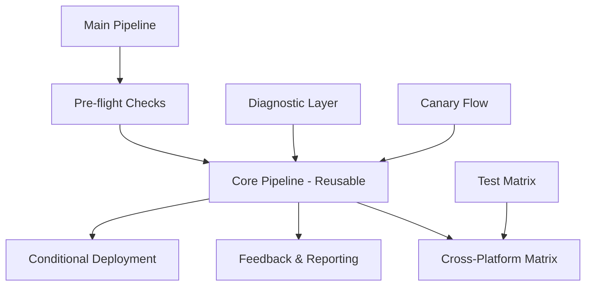

# 🧜‍♀️ RinaWarp Terminal CI/CD Strategy

> *A comprehensive guide to our modular, resilient, and proactively informative CI/CD architecture*

## 🌊 Overview

Our CI/CD system is designed like the ocean itself - flowing, adaptive, and powerful. It combines modular workflows, intelligent feedback loops, and the enchanting personality of our mermaid-themed terminal.

## 📋 Table of Contents

- [🧵 Modular Workflow Patterns](#-modular-workflow-patterns)
- [🔄 Automated Feedback Loop](#-automated-feedback-loop)
- [🧠 Intelligent Caching & Restoration](#-intelligent-caching--restoration)
- [💡 Observability & Insights](#-observability--insights)
- [🚀 Quick Start Guide](#-quick-start-guide)
- [🛠️ Troubleshooting](#️-troubleshooting)

## 🧵 Modular Workflow Patterns

### Core Architecture

Our CI/CD system is split into purpose-driven modules:



### 1. **Core Pipeline** (`reusable-core.yml`)
- **Purpose**: Build, test, and lint operations
- **Features**: 
  - Smart dependency caching with checksum-based invalidation
  - Environment-specific configurations
  - Detailed failure analysis with "🧜‍♀️ Mermaid Weeps" messaging
  - Build timing and performance metrics

**Usage Example:**
```yaml
uses: ./.github/workflows/reusable-core.yml
with:
  node-version: '18'
  cache-strategy: 'npm'
  skip-tests: false
  environment: 'staging'
```

### 2. **Main Pipeline** (`main-pipeline.yml`)
- **Purpose**: Orchestrates the entire CI/CD flow
- **Features**:
  - Intelligent environment detection
  - Cross-platform testing matrix
  - Automated PR feedback and labeling
  - Conditional deployment logic

### 3. **Existing Specialized Workflows**
- `test-canary.yml` - Sanity check baseline
- `diagnostic-steps.yml` - Debug node/NPM/env/permissions
- `ultra-minimal.yml` - Lightweight validation

## 🔄 Automated Feedback Loop

### Smart Error Detection & Reporting

Our system makes failures actionable through:

#### 1. **Mermaid-Themed Error Messages**
```bash
🧜‍♀️ Mermaid Weeps: Lint issues detected
🧜‍♀️ Mermaid Notices: Some tests failed on windows-latest
🌊 All systems flowing smoothly!
```

#### 2. **Automatic PR Comments**
When a PR fails, our system automatically generates detailed reports:

```markdown
## 🧜‍♀️ RinaWarp Terminal CI/CD Report

🌊 **Core Pipeline**: ❌ Mermaid Weeps - issues detected

### 📊 Detailed Results:
- 🔍 **Lint**: ❌
- 🏗️ **Build**: ✅
- 🧪 **Tests**: ✅
- 🌐 **Cross-Platform**: ❌

### 🚨 Action Required:
- Fix linting issues

---
*Generated by RinaWarp Terminal CI/CD 🧜‍♀️*
```

#### 3. **Auto-Labeling System**
Failed PRs are automatically labeled:
- `🔍 lint-issues` - ESLint violations detected
- `🏗️ build-issues` - Build process failures
- `🧪 test-issues` - Test suite failures

#### 4. **Retry Logic** (Future Enhancement)
```yaml
# Example retry pattern with exponential backoff
- name: 🔄 Retry on Network Failure
  uses: nick-invision/retry@v2
  with:
    timeout_minutes: 10
    max_attempts: 3
    retry_wait_seconds: 30
    command: npm ci
```

## 🧠 Intelligent Caching & Restoration

### Multi-Level Caching Strategy

#### 1. **Dependency Caching**
```yaml
- name: 🧜‍♀️ Cache Dependencies (Smart Invalidation)
  uses: actions/cache@v3
  with:
    path: |
      ~/.npm
      node_modules
      .eslintcache
    key: ${{ runner.os }}-deps-${{ hashFiles('**/package-lock.json', '.eslintrc.*') }}
    restore-keys: |
      ${{ runner.os }}-deps-
```

#### 2. **Build Artifact Caching**
- Caches compiled assets between jobs
- Uses checksum-based invalidation
- Supports incremental builds

#### 3. **ESLint Cache**
- Preserves `.eslintcache` for faster subsequent runs
- Automatically invalidated when lint config changes

### Cache Invalidation Strategy

Our cache keys are designed for smart invalidation:

| Cache Type | Invalidation Trigger | Key Pattern |
|------------|---------------------|-------------|
| Dependencies | `package-lock.json` changes | `deps-{hash}` |
| ESLint | `.eslintrc.*` changes | `lint-{hash}` |
| Build Assets | Source code changes | `build-{hash}` |

## 💡 Observability & Insights

### Real-Time Performance Metrics

#### 1. **Build Timing**
```yaml
- name: 🏗️ Build Project
  run: |
    start_time=$(date +%s)
    npm run build
    end_time=$(date +%s)
    duration=$((end_time - start_time))
    echo "✅ Build completed in ${duration}s"
    echo "build-duration=${duration}" >> $GITHUB_OUTPUT
```

#### 2. **Coverage Reporting**
- Automatic coverage artifact upload
- Environment-specific coverage reports
- Integration with code quality tools

#### 3. **Cross-Platform Insights**
Our matrix strategy provides insights across:
- **Operating Systems**: Ubuntu, Windows, macOS
- **Node.js Versions**: 16, 18, 20
- **Failure Patterns**: Platform-specific issues

### Diagnostic Dashboard

#### Workflow Status Indicators
```
🌊 Core Pipeline: ✅ Flowing
🌐 Cross-Platform: ⚠️ Turbulent Waters
🚀 Deployment: 🚧 Preparing
```

#### Performance Baselines
- Build time tracking
- Test execution metrics
- Cache hit/miss ratios

## 🚀 Quick Start Guide

### For Contributors

1. **Fork and Clone**
   ```bash
   git clone https://github.com/your-username/rinawarp-terminal-fresh.git
   cd rinawarp-terminal-fresh
   ```

2. **Local Development**
   ```bash
   npm install
   npm run lint      # 🔍 Check code quality
   npm run build     # 🏗️ Build the project
   npm test          # 🧪 Run tests
   ```

3. **Creating a PR**
   - Push to your fork
   - Create PR against `main` branch
   - Watch for automated feedback 🧜‍♀️

### For Maintainers

#### Manual Workflow Triggers
```bash
# Trigger specific environment deployment
gh workflow run "🌊 Main Pipeline" \
  --ref main \
  -f environment=staging \
  -f skip-tests=false
```

#### Emergency Procedures
```bash
# Quick diagnostic run
gh workflow run "🔧 Diagnostic Steps" --ref main

# Minimal validation
gh workflow run "⚡ Ultra Minimal CI" --ref main
```

## 🛠️ Troubleshooting

### Common Issues & Solutions

#### "🧜‍♀️ Mermaid Weeps: Lint issues detected"
```bash
# Fix locally
npm run lint:fix
git add .
git commit -m "Fix linting issues"
```

#### "Cache Miss on Dependencies"
- Check if `package-lock.json` was modified
- Verify cache key generation in workflow logs
- Consider clearing cache manually in GitHub Actions settings

#### "Cross-Platform Test Failures"
```bash
# Test locally on different Node versions
nvm use 16 && npm test
nvm use 18 && npm test
nvm use 20 && npm test
```

### Getting Help

1. **Check Workflow Logs**: Look for 🧜‍♀️ themed messages
2. **Review Auto-Generated PR Comments**: Contains actionable insights
3. **Check Labels**: Auto-applied labels indicate failure categories
4. **Manual Diagnostics**: Use the diagnostic workflow for deep analysis

### Debugging Workflow Failures

#### Step-by-Step Debugging Process:

1. **Review the Auto-Generated Report**
   - Check PR comments for the detailed breakdown
   - Note which specific steps failed

2. **Examine Workflow Logs**
   ```
   🌊 Installing dependencies for staging environment...
   🧜‍♀️ Running lint checks...
   🧜‍♀️ Mermaid Weeps: Lint issues detected
   ```

3. **Local Reproduction**
   ```bash
   # Reproduce the exact environment
   npm ci --prefer-offline --no-audit
   npm run lint
   ```

4. **Check Matrix Results**
   - Look for platform-specific failures
   - Note Node.js version compatibility issues

## 🌊 Advanced Features

### Custom Environment Variables

```yaml
env:
  MERMAID_THEME: enabled
  CI_ENVIRONMENT: ${{ inputs.environment }}
  ENABLE_DIAGNOSTICS: true
```

### Conditional Logic Examples

```yaml
# Skip deployment on draft PRs
if: github.event.pull_request.draft != true

# Environment-specific steps
if: needs.preflight.outputs.target-env == 'prod'

# Failure-specific actions
if: needs.core-pipeline.outputs.lint-status != 'success'
```

### Integration Hooks

Our system supports various integration points:

- **Slack Notifications**: Post-deployment updates
- **Discord Webhooks**: Development team alerts
- **Email Reports**: Daily/weekly CI/CD summaries
- **Monitoring Dashboards**: Real-time pipeline health

## 📊 Metrics & Analytics

### Key Performance Indicators (KPIs)

- **Build Success Rate**: Target >95%
- **Average Build Time**: Target <5 minutes
- **Test Coverage**: Target >80%
- **Cache Hit Rate**: Target >90%

### Monthly Reports

Our system can generate comprehensive monthly reports including:
- Pipeline performance trends
- Most common failure patterns
- Platform-specific statistics
- Contributor activity insights

---

## 🧜‍♀️ The Mermaid's Wisdom

> *"Like the ocean tides, good CI/CD flows predictably yet adapts to every shore it touches. Our pipelines don't just build software—they nurture a thriving ecosystem where every commit is a drop that creates ripples of quality throughout the entire codebase."*

**Remember**: Every failure is just the ocean teaching us to swim better! 🌊

---

*Built with 💙 by the RinaWarp Terminal team*
*"Making terminal experiences magical, one commit at a time"* ✨
