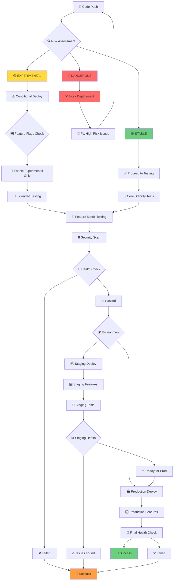
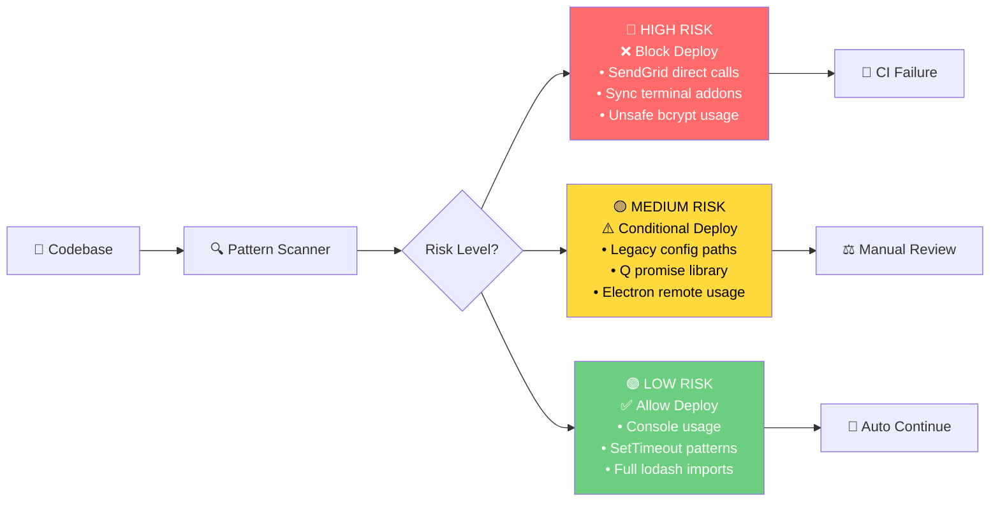
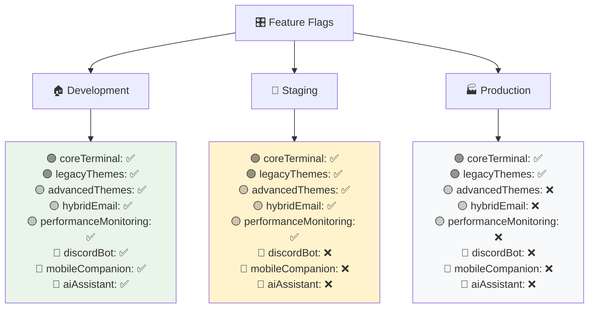
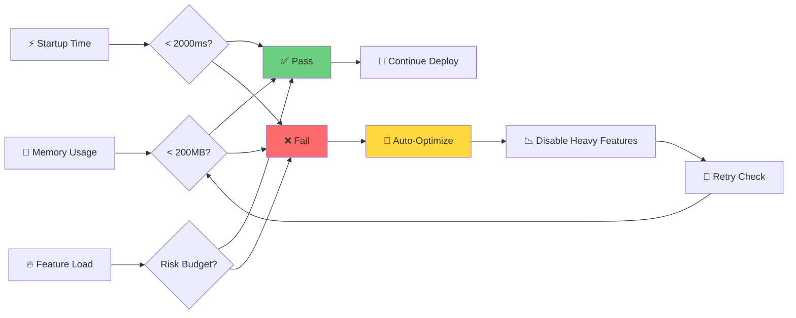
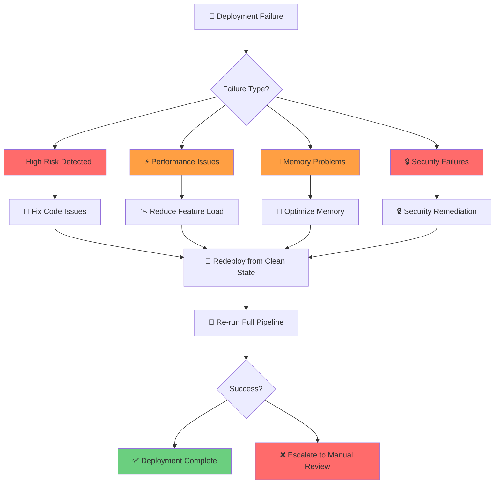
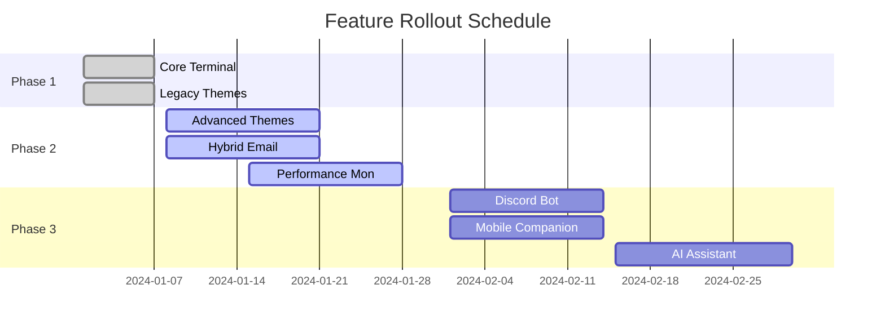

# 🧜‍♀️ RinaWarp Terminal - Risk-Based Deployment Flow

## 📊 Deployment Architecture Overview



## 🎯 Risk-Based Decision Matrix

### Phase 1: Risk Assessment & Pattern Scanning



### Phase 2: Feature Flag Configuration by Environment



### Phase 3: Performance & Health Monitoring



## 🎛️ Boot Profile Dashboard

### Real-Time Monitoring Display

```
🧜‍♀️ RinaWarp Terminal - Boot Profile Dashboard
════════════════════════════════════════════════════════════════

🎯 Feature Rollout Matrix
────────────────────────────────────────────────────────────────
🟢 STABLE        Count:  2 | Memory:   15MB | Status: Normal
🟡 EXPERIMENTAL  Count:  3 | Memory:   45MB | Status: Testing  
🔴 DANGEROUS     Count:  0 | Memory:    0MB | Status: None

⚡ Performance Metrics
────────────────────────────────────────────────────────────────
🧠 Memory Usage: ████████████░░░░░░░░ 65%
⚡ Heap Used: 130MB
⚡ Uptime: 45s
⚠️ Recent warnings: 0

🚀 Boot Sequence Timeline
────────────────────────────────────────────────────────────────
✅ 🟢 coreTerminal        125ms |   10MB
✅ 🟢 legacyThemes        245ms |    5MB
✅ 🟡 advancedThemes      467ms |   20MB
✅ 🟡 hybridEmail         523ms |   15MB
✅ 🟡 performanceMonitor  678ms |   10MB

📊 Real-time Status
────────────────────────────────────────────────────────────────
✅ Enabled: 5 | ❌ Disabled: 3
🟢 Safe: 2 | 🟡 Testing: 3 | 🔴 Risky: 0
🏥 System Health: ████████████████ 92%

────────────────────────────────────────────────────────────────
Last updated: 14:32:15 | Press Ctrl+C to stop monitoring
```

## 🚨 Deployment Decision Tree

### Automated CI/CD Logic

```yaml
# Risk-based deployment logic
if (high_risk_patterns > 0):
    ❌ BLOCK_DEPLOYMENT
    📝 require_manual_fixes = true
    
elif (medium_risk_patterns > 5):
    ⚠️ CONDITIONAL_DEPLOYMENT
    🎛️ enable_feature_flags = STABLE_ONLY
    🧪 require_extended_testing = true
    
elif (startup_time > 2000ms):
    ⚡ PERFORMANCE_OPTIMIZATION
    📉 auto_disable_heavy_features = true
    🔄 retry_deployment = true
    
elif (memory_usage > 200MB):
    🧠 MEMORY_OPTIMIZATION  
    📉 auto_disable_memory_intensive = true
    🔄 retry_deployment = true
    
else:
    ✅ PROCEED_TO_DEPLOYMENT
    🎯 environment = determine_target()
    🚀 deploy_with_appropriate_flags = true
```

## 🔄 Rollback Strategy

### Failure Detection & Response



## 📊 Deployment Metrics & KPIs

### Success Criteria Dashboard

| Phase | Metric | Target | Current | Status |
|-------|--------|--------|---------|--------|
| **Risk Assessment** | High Risk Issues | 0 | 0 | ✅ |
| **Risk Assessment** | Medium Risk Issues | < 5 | 2 | ✅ |
| **Performance** | Startup Time | < 2000ms | 1850ms | ✅ |
| **Performance** | Memory Usage | < 200MB | 165MB | ✅ |
| **Features** | Stable Features | 100% | 100% | ✅ |
| **Features** | Experimental Features | 0% (Prod) | 0% | ✅ |
| **Security** | Vulnerabilities | 0 High | 0 | ✅ |
| **Health** | System Health Score | > 90% | 94% | ✅ |

### Feature Adoption Timeline



## 🎯 Usage Examples

### Quick Health Check

```bash
# Check current feature status
npm run check:features

# Monitor boot profile
npm run monitor:boot

# Run risk assessment
npm run scan:risks

# Generate deployment report
npm run report:deployment
```

### Feature Flag Management

```bash
# Enable experimental feature for testing
npm run feature:enable advancedThemes --environment staging

# Disable risky feature if issues detected  
npm run feature:disable aiAssistant --reason "memory-usage-high"

# Get current feature matrix
npm run feature:status --format table
```

### Emergency Rollback

```bash
# Immediate rollback to stable
npm run rollback:emergency

# Rollback specific feature
npm run rollback:feature mobileCompanion

# Validate rollback success
npm run validate:rollback
```

---

## 🧜‍♀️ Summary

This risk-based deployment flow ensures:

- **🔒 Safety First**: High-risk patterns block deployment automatically
- **🎛️ Progressive Rollout**: Features enabled based on risk and environment
- **📊 Real-time Monitoring**: Continuous health monitoring during deployment
- **🔄 Automated Recovery**: Intelligent rollback on performance issues
- **🧪 Thorough Testing**: Multi-matrix testing across feature combinations
- **⚡ Performance Guarantees**: Hard limits on startup time and memory usage

The system is **emotionally adaptive** and **strategically modular**, ensuring that RinaWarp Terminal maintains its reliability while progressively adopting enterprise-grade capabilities.
