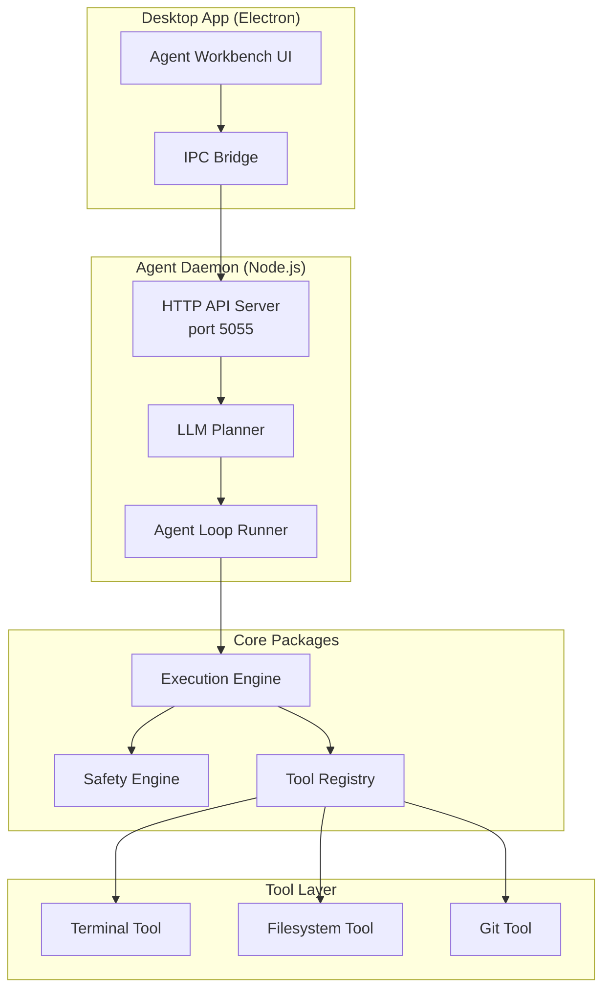
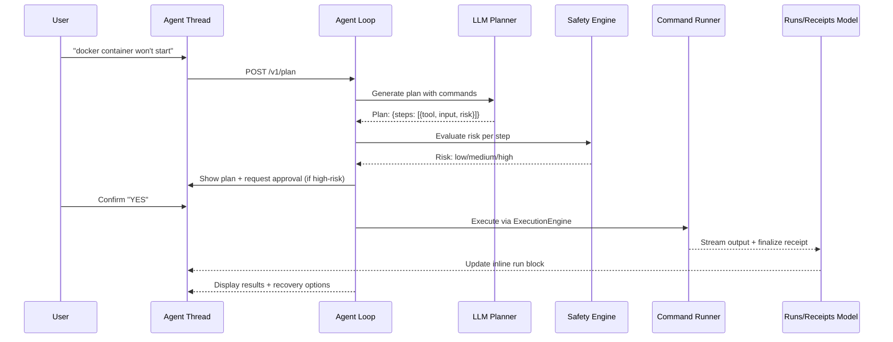

# RinaWarp Terminal Pro - Full Architecture

> **Version**: 1.0.4  
> **Last Updated**: 2026-03-19

> Product direction is locked in [PRODUCT_WORKBENCH_REQUIREMENTS.md](/home/karina/Documents/rinawarp-terminal-pro/docs/PRODUCT_WORKBENCH_REQUIREMENTS.md). If implementation details conflict with that document, the product requirements win.

## Executive Summary

RinaWarp Terminal Pro is an agent workbench for build, test, deploy, and repair workflows. Users ask Rina to do work in plain language, Rina explains the plan, executes through a trusted runner, and keeps proof and recovery attached to the thread.

### Core Philosophy

```
Agent Thread → Plan → Trusted Execution → Proof → Recovery
```

---

## High-Level System Architecture



---

## Package Overview

| Package | Purpose | Key Files |
|---------|---------|-----------|
| **rinawarp-agentd** | Main daemon/server, API endpoints | `server.ts` (3492 LOC), `index.ts` |
| **rinawarp-agent** | Context collector & runtime | `runtime.ts` |
| **rinawarp-core** | Enforcement engine & tool registry | `enforcement/index.ts` |
| **rinawarp-tools** | Terminal, filesystem, git tools | `terminal.ts`, `filesystem.ts`, `git.ts` |
| **rinawarp-safety** | Risk classification & policy | `policy.ts`, `permissionChecker.ts` |
| **rinawarp-context** | Context indexing & retrieval | `contextEngine.ts`, `indexer/` |
| **rinawarp-api-client** | HTTP client SDK | `client.ts`, `http.ts` |

---

## Execution Flow



---

## Safety System (4 Layers)

### Layer 1: Command Classification
```typescript
const classify = (cmd: string): 'safe' | 'moderate' | 'dangerous' => {
  if (cmd.includes('rm -rf') || cmd.includes('mkfs')) return 'dangerous';
  if (cmd.includes('kill') || cmd.includes('docker stop')) return 'moderate';
  return 'safe';
};
```

### Layer 2: Risk Scoring
```typescript
interface RiskScore {
  level: 'low' | 'medium' | 'high' | 'critical';
  reasons: string[];
  blocked: boolean;
}
```

### Layer 3: Execution Policy
```typescript
const policy = {
  low: 'auto_run',
  medium: 'ask_approval', 
  high: 'block',
  critical: 'block_with_warning'
};
```

### Layer 4: Sandboxing
- Container-based execution (`Dockerfile`)
- Restricted user permissions
- Filesystem namespace isolation

---

## License-Based Access Control

The `ExecutionEngine` (`packages/rinawarp-core/src/enforcement/index.ts`) enforces tool access based on license tier:

| Tier | Read | Safe-Write | High-Impact |
|------|------|------------|-------------|
| **starter/creator** | ✅ | ✅ | ❌ |
| **pro/pioneer** | ✅ | ✅ | deploy.prod only |
| **founder/enterprise** | ✅ | ✅ | ✅ All |

---

## API Server Endpoints

Base URL: `http://localhost:5055` (configurable via `RINAWARP_AGENTD_PORT`)

### Core Endpoints

| Method | Endpoint | Purpose |
|--------|----------|---------|
| POST | `/v1/plan` | Generate execution plan from intent |
| POST | `/v1/execute-plan` | Execute a plan with safety checks |
| GET | `/v1/stream` | SSE stream for execution progress |
| POST | `/v1/cancel` | Cancel running plan |
| GET | `/v1/report` | Get execution report by planRunId |
| GET | `/v1/metrics` | Get analytics metrics |

### Authentication

| Method | Endpoint | Purpose |
|--------|----------|---------|
| POST | `/v1/auth/login` | Login with email/password |
| POST | `/v1/auth/refresh` | Refresh access token |
| POST | `/v1/auth/revoke` | Revoke refresh token |

### Daemon Management

| Method | Endpoint | Purpose |
|--------|----------|---------|
| GET | `/v1/daemon/status` | Get daemon status |
| POST | `/v1/daemon/start` | Start daemon process |
| POST | `/v1/daemon/stop` | Stop daemon process |
| GET | `/v1/daemon/tasks` | List background tasks |

### Workspace/Team

| Method | Endpoint | Purpose |
|--------|----------|---------|
| POST | `/v1/workspaces` | Create workspace |
| GET | `/v1/workspaces/:id` | Get workspace |
| POST | `/v1/workspaces/:id/invites` | Invite user |
| POST | `/v1/invites/accept` | Accept invite |

---

## Directory Structure

```
rinawarp-terminal-pro/
├── apps/terminal-pro/          # Electron desktop app
│   └── src/
│       ├── main.ts            # Entry point
│       ├── renderer/          # React UI components
│       └── main/ipc/          # IPC handlers
│
├── packages/
│   ├── rinawarp-agentd/      # Main daemon (HTTP server)
│   │   └── src/
│   │       ├── server.ts      # API server (~3500 lines)
│   │       ├── index.ts       # Entry point
│   │       ├── types.ts       # Type definitions
│   │       ├── daemon/        # Background task runner
│   │       │   ├── runner.ts
│   │       │   ├── state.ts
│   │       │   └── task-contracts.ts
│   │       ├── workspace/     # Workspace state management
│   │       │   ├── state.ts
│   │       │   ├── email.ts
│   │       │   └── tokenLifecycle.ts
│   │       ├── ai/            # AI client
│   │       │   ├── client.ts  # OpenAI integration
│   │       │   └── prompt.ts
│   │       ├── terminal/     # PTY management
│   │       │   ├── pty.ts
│   │       │   ├── blocks.ts
│   │       │   └── history.ts
│   │       ├── orchestrator/  # GitHub integration
│   │       │   ├── workspaceGraph.ts
│   │       │   ├── githubAdapter.ts
│   │       │   └── gitProvider.ts
│   │       └── safety/        # Safety policies
│   │           ├── policies.ts
│   │           └── validator.ts
│   │
│   ├── rinawarp-agent/        # Context collection
│   │   └── src/
│   │       ├── runtime.ts     # Plan execution with safety
│   │       ├── types.ts
│   │       └── security/    # Agent security
│   │
│   ├── rinawarp-core/        # Core enforcement
│   │   └── src/
│   │       ├── enforcement/  # Execution engine
│   │       │   ├── index.ts  # ExecutionEngine class
│   │       │   ├── types.ts
│   │       │   └── engine-cap.ts
│   │       └── tools/       # Tool registry
│   │           └── registry.ts
│   │
│   ├── rinawarp-tools/        # Tool implementations
│   │   └── src/
│   │       ├── terminal.ts   # Shell execution
│   │       ├── filesystem.ts # File operations
│   │       └── git.ts       # Git operations
│   │
│   ├── rinawarp-safety/       # Safety policies
│   │   └── src/
│   │       ├── policy.ts     # Risk policies
│   │       ├── permissionChecker.ts
│   │       └── redaction.ts
│   │
│   ├── rinawarp-context/     # Context indexing
│   │   └── src/
│   │       ├── contextEngine.ts
│   │       ├── indexer/
│   │       │   ├── fileIndexer.ts
│   │       │   ├── gitIndexer.ts
│   │       │   └── terminalIndexer.ts
│   │       └── retrieval/
│   │           └── search.ts
│   │
│   ├── rinawarp-api-client/  # HTTP client SDK
│   │   └── src/
│   │       ├── client.ts
│   │       ├── http.ts
│   │       └── types.ts
│   │
│   ├── rinawarp-agent-sdk/   # Agent SDK
│   │   └── src/
│   │       ├── cli/         # CLI tools
│   │       └── runtime/     # Runtime API
│   │
│   └── rinawarp-dashboard/   # Admin dashboard UI
│
└── docs/
    └── MVP_ARCHITECTURE.md   # Detailed MVP architecture
```

---

## Key Technologies

| Component | Technology |
|-----------|------------|
| Desktop Framework | Electron 28+ |
| Runtime | Node.js 18+ |
| Language | TypeScript |
| Package Manager | pnpm |
| AI | OpenAI GPT-4o / Anthropic Claude |
| Self-hosted | Ollama (via baseURL) |

---

## Data Flow

```mermaid
graph LR
    Input[User Input<br/>e.g., "fix docker"]
    --> Intent[Intent Parsing]
    --> Plan[Plan Generation<br/>LLM]
    --> Safety[Safety Evaluation]
    --> Confirm{Approval<br/>Required?}
    -->|Yes| User[User Confirmation]
    -->|No| Execute[Execute via<br/>Engine]
    -->|Yes| Execute
    --> Output[Return Output<br/>+ SSE Stream]
    
    User -->|Approve| Execute
```

---

## Security Features

1. **Command Splitting** - Prevents shell injection
   ```typescript
   function splitCommand(cmd: string): { file: string; args: string[] } {
     const parts = cmd.trim().split(/\s+/)
     return { file: parts[0], args: parts.slice(1) }
   }
   ```

2. **Environment Filtering** - Blocks credential bleed
   ```typescript
   const BLOCKED = [
     'AWS_SECRET_ACCESS_KEY',
     'STRIPE_SECRET_KEY',
     'DATABASE_URL',
     'GITHUB_TOKEN',
     // ... more sensitive vars
   ]
   ```

3. **Emergency Controls**
   - `RINAWARP_EMERGENCY_READ_ONLY=1` - Read-only mode
   - `RINAWARP_DISABLE_HIGH_IMPACT=1` - Block high-impact tools
   - `RINAWARP_BLOCK_TOOLS` - Comma-separated tool blocklist

---

## Configuration

Environment variables for agentd:

| Variable | Default | Description |
|----------|---------|-------------|
| `RINAWARP_AGENTD_PORT` | 5055 | Server port |
| `RINAWARP_AGENTD_BIND_HOST` | 127.0.0.1 | Bind address |
| `RINAWARP_AGENTD_AUTH_SECRET` | - | JWT signing secret |
| `OPENAI_API_KEY` | - | OpenAI API key |
| `STRIPE_SECRET_KEY` | - | Stripe for payments |

---

## References

- Main Documentation: [`docs/MVP_ARCHITECTURE.md`](docs/MVP_ARCHITECTURE.md)
- Server Implementation: [`packages/rinawarp-agentd/src/server.ts`](packages/rinawarp-agentd/src/server.ts)
- Execution Engine: [`packages/rinawarp-core/src/enforcement/index.ts`](packages/rinawarp-core/src/enforcement/index.ts)
- Terminal Tool: [`packages/rinawarp-tools/src/terminal.ts`](packages/rinawarp-tools/src/terminal.ts)
