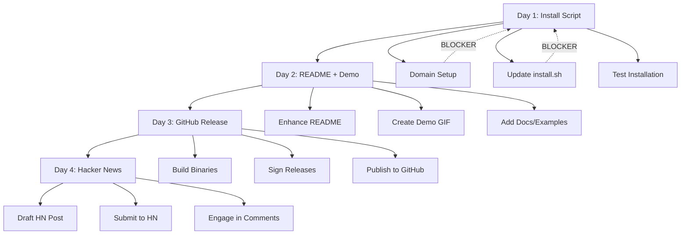

# RinaWarp Product Launch Plan

## Executive Summary

**Launch Readiness Assessment: PARTIALLY READY**

Based on the current project state, here's what's ready and what needs work:

| Area | Status | Notes |
|------|--------|-------|
| Install Script | ✅ Ready | [`install.sh`](install.sh) v1.0.4 exists - needs domain update |
| README.md | ✅ Basic Ready | Tagline + structure exists - needs optimization |
| Release Artifacts | ✅ Ready | GPG keys, checksums in [`release/v1.0.4/`](release/v1.0.4/) |
| Demo GIF | ❌ Missing | Needs creation |
| Docs/Examples | ⚠️ Minimal | Only [`docs/MVP_ARCHITECTURE.md`](docs/MVP_ARCHITECTURE.md) exists |
| Domain (rinawarptech.com) | ✅ Ready | Already owned |
| GitHub Release | ⚠️ Partial | Binaries need verification |

---

## Current Project State

### What's Already in Place

1. **Install Script** ([`install.sh`](install.sh))
   - Version: v1.0.4
   - Supports: Linux (AppImage), macOS (dmg), Windows (exe)
   - Currently points to: `https://raw.githubusercontent.com/Bigsgotchu/rinawarp-terminal-pro/main/install.sh`
   - Downloads from GitHub Releases

2. **README.md** ([`README.md`](README.md))
   - Tagline: "The First AI You Can Trust to Actually Fix Things"
   - Basic features list
   - Quick install command
   - System requirements
   - Build from source instructions

3. **Release Artifacts** ([`release/v1.0.4/`](release/v1.0.4/))
   - `RINAWARP_GPG_PUBLIC_KEY.asc` - GPG public key
   - `SHASUMS256.txt` - Checksums
   - `SHASUMS256.txt.asc` - Signed checksums

4. **Version**: v1.0.4 in [`package.json`](package.json) and [`apps/terminal-pro/package.json`](apps/terminal-pro/package.json:4)

5. **Build Scripts**: Available via `npm run dist:linux`, `npm run dist:win`, etc.

---

## Blocking Issues Identified

### Critical Blockers (Must Fix Before Launch)

1. **Domain Setup** - `rinawarptech.com` is already owned - serve install from rinawarptech.com/install
2. **Binaries** - Need to verify actual .exe/.dmg/.AppImage files exist in GitHub Releases
3. **Install Script Update** - Must update to use `rinawarptech.com/install` instead of raw GitHub URL

### Important (Should Fix Before Launch)

4. **Demo Asset** - No demo GIF exists for README or HN post
5. **Documentation** - Only MVP architecture doc exists; needs quickstart guide

### Nice to Have

6. **Examples Folder** - No usage examples exist yet

---

## Launch Sequence Timeline

### Day 1: Install Script & Domain Setup

**Goal**: Users can run `curl -fsSL https://rinawarptech.com/install | bash` successfully

| Task | Deliverable | Owner |
|------|-------------|-------|
| Register/configure rinawarptech.com domain | Already owned |
| Update install.sh to use rinawarptech.com URL | Modified [`install.sh`](install.sh) | Code mode |
| Test installation flow end-to-end | Verified working install | Code mode |
| Upload binaries to GitHub Releases (if not present) | Binaries available for download | Code mode |

**Install Script Updates Needed:**
```bash
# Change this line in install.sh:
# FROM: curl -fsSL https://raw.githubusercontent.com/Bigsgotchu/rinawarp-terminal-pro/main/install.sh | bash
# TO:   curl -fsSL https://rinawarptech.com/install | bash
```

### Day 2: README + Demo Asset

**Goal**: First impression on GitHub is compelling

| Task | Deliverable | Owner |
|------|-------------|-------|
| Optimize README.md structure | Enhanced [`README.md`](README.md) | Code mode |
| Create demo GIF specification | Demo spec document | This plan |
| Create demo GIF | Animated demo | Code mode |
| Add docs/ folder with quickstart | [`docs/QUICKSTART.md`](docs/QUICKSTART.md) | Code mode |
| Add examples/ folder | [`examples/`](examples/) folder | Code mode |

**README Structure Recommendations:**
1. Move tagline to hero
2. Add demo GIF at top (above fold)
3. Simplify install command to `curl -fsSL https://rinawarptech.com/install | bash`
4. Add "What can RinaWarp do?" section with concrete examples
5. Add trust indicators (security, local-first)
6. Add "Built with" section showing tech stack

### Day 3: GitHub Release

**Goal**: Formal release is published and verifiable

| Task | Deliverable | Owner |
|------|-------------|-------|
| Create GitHub Release v1.0.4 | Release page published | Code mode |
| Attach signed binaries | .exe, .dmg, .AppImage files | Code mode |
| Verify GPG signatures | Signatures work correctly | Code mode |
| Update release notes | Changelog published | Code mode |

**Release Notes Structure:**
- What's new in v1.0.4
- Installation instructions
- Security verification steps (GPG)
- Known issues

### Day 4: Hacker News Launch

**Goal**: Show HN post goes live and gets traction

| Task | Deliverable | Owner |
|------|-------------|-------|
| Draft Show HN post | [`docs/SHOWHN_DRAFT.md`](docs/SHOWHN_DRAFT.md) | This plan |
| Review and finalize post | Finalized HN content | User |
| Submit to Hacker News | Post submitted | User |
| Prepare follow-up responses | Response templates | User |

---

## Assets: Ready vs. Needs Creation

### Ready to Use

| Asset | Location | Status |
|-------|----------|--------|
| Install script | [`install.sh`](install.sh) | ✅ Ready (needs URL update) |
| GPG keys | [`release/v1.0.4/`](release/v1.0.4/) | ✅ Ready |
| Version info | `package.json` | ✅ Ready |
| Basic README | [`README.md`](README.md) | ✅ Ready (needs enhancement) |

### Needs Creation

| Asset | Location | Priority | Effort |
|-------|----------|----------|--------|
| Demo GIF | `/assets/demo.gif` | HIGH | Medium |
| Quickstart guide | `docs/QUICKSTART.md` | HIGH | Low |
| Usage examples | `examples/` folder | MEDIUM | Medium |
| Show HN post | `docs/SHOWHN_DRAFT.md` | HIGH | Low |

---

## Detailed Action Items

### Day 1: Install Script

#### 1.1 Domain Setup (BLOCKER)
- [ ] Register rinawarptech.com domain (already owned)
- [ ] Configure DNS to serve install script content
- [ ] Alternative: Use GitHub Pages or redirect

#### 1.2 Install Script Updates
- [ ] Update `INSTALL_URL` in [`install.sh`](install.sh:7) to `https://rinawarptech.com/install`
- [ ] Verify all download URLs point to correct GitHub release
- [ ] Add version checking (optional but recommended)
- [ ] Test on Linux (AppImage)
- [ ] Test on macOS (dmg) - if available
- [ ] Test on Windows (exe) - if available

### Day 2: README + Demo

#### 2.1 README Enhancements
- [ ] Add demo GIF near top (after tagline)
- [ ] Rewrite tagline for impact
- [ ] Add "What can RinaWarp do?" with 3 concrete examples
- [ ] Add security/trust section
- [ ] Update install command to use rinawarptech.com
- [ ] Add tech stack badges

#### 2.2 Demo GIF Creation
**Recommended approach:**
1. Record terminal session showing:
   - User typing a problem (e.g., "my node_modules is broken")
   - RinaWarp analyzing the issue
   - RinaWarp proposing a fix
   - User approving the fix
   - Fix being applied successfully
2. Use tools like: terminalizer, asciinema, or licecap
3. Keep under 30 seconds
4. Add captions for clarity

#### 2.3 Documentation
- [ ] Create `docs/QUICKSTART.md` (2-3 pages max)
- [ ] Create `examples/` folder with 3-5 common use cases

### Day 3: GitHub Release

#### 3.1 Release Process
- [ ] Build binaries (if not already done):
  - Linux: `npm run dist:linux`
  - Windows: `npm run dist:win`
  - macOS: `npm run dist:mac`
- [ ] Generate checksums: `shasum -a 256 *.AppImage *.dmg *.exe > SHASUMS256.txt`
- [ ] Sign checksums with GPG
- [ ] Upload to GitHub Releases
- [ ] Verify download links work

### Day 4: Hacker News

#### 4.1 Show HN Post Structure
```
Title: Show HN: RinaWarp – The First AI You Can Trust to Actually Fix Things

Body:
- One-line description
- Demo GIF
- How it works (2-3 sentences)
- Why it's different (safety, transparency, local-first)
- Install command
- Link to GitHub

Comments (prepare in advance):
- Answer about security model
- Answer about AI model used
- Answer about offline capability
```

---

## Hacker News Show HN Draft

See [`docs/SHOWHN_DRAFT.md`](docs/SHOWHN_DRAFT.md) for the full draft content.

### Key Points for HN:
1. **Hook**: "I've spent 10 years dealing with broken development environments. Built an AI that actually fixes them."
2. **Trust**: "Every command shown before execution. High-impact commands need explicit approval."
3. **Privacy**: "Local-first. Your system data never leaves your machine."
4. **Demo**: Show, don't just tell

### ⚠️ Important HN Positioning Notes (Updated based on feedback):

**Title**: Use "AI terminal that diagnoses and explains system errors" - avoid "First AI" claims

**No Placeholders**: Don't include broken GIF links - either have a real demo or remove it

**Position as Diagnostic Tool**: 
- ✅ A tool that helps humans fix problems
- ❌ NOT an autonomous fixer of everything

**Distribution Beyond HN**:
- GitHub Launch
- Developer Twitter/X
- Reddit (r/programming, r/devops, r/docker)
- Product Hunt (after HN gains traction)

Traffic diversity matters - HN alone is volatile.

---

## Mermaid: Launch Workflow



---

## Next Steps

1. **User confirms plan** - Approve this launch plan
2. **Begin Day 0 prep** - Start with domain setup and install script updates
3. **Parallel work**: Start demo GIF creation while domain is being configured
4. **Schedule**: Execute Day 1 → Day 4 in sequence

---

## Questions for Clarification

1. Is the `rinawarptech.com` domain ready for install redirects?
2. Are the binaries (.exe, .dmg, .AppImage) already built and uploaded to GitHub?
3. Which demo scenario should the GIF showcase? (error诊断, system fix, debugging)
4. Is there a preferred tool for creating the demo GIF?
